# Functional Architecture: Unified Explainer + E-Commerce System

## RAG & Context Engineering — Precision Breakdown for Both Systems


### Explainer: Recursive RAG + Recursive Context

| Dimension | Explainer |
|---|---|
| **RAG Trigger** | Every depth level (Macro at root, Micro on every drill-down) |
| **RAG Input** | VLM Bridge output (visual→text) + parent semantic_path |
| **RAG Purpose** | Prevent hallucinated internal structures; force factual density |
| **RAG Output** | 2-sentence visual instruction (distilled from chunks) injected into image prompt |
| **Context Type** | Recursive — each child inherits + mutates parent context |
| **Semantic Context** | Rolling `semantic_path` — bounded token length, ancestral lineage preserved |
| **Visual Context** | Dual-image reference (Root=style, Red-Dot Parent=spatial) + color palette chain |
| **Depth Risk** | Semantic drift by Depth 3, visual style collapse by Depth 4 |
| **Critical Fix** | Context distillation (LLM compresses path) + img2img style lock (IP-Adapter) |

### E-Commerce: Single-Shot RAG + Session Context

| Dimension | E-Commerce |
|---|---|
| **RAG Trigger** | Once per search (after Vision AI identification) |
| **RAG Input** | Vision AI labels + detected category |
| **RAG Purpose** | Enrich search queries with product knowledge; category taxonomy mapping |
| **RAG Output** | Expanded search terms, product spec comparisons, category routing |
| **Context Type** | Linear — session-scoped, no recursion |
| **Search Context** | Session query history, recognition confidence map, interaction log |
| **Ranking Context** | Previous result clicks, price preference signals |
| **Depth Risk** | None (single-level search) — risk is relevance accuracy, not drift |
| **Critical Fix** | Query enrichment before federated search; context-aware re-ranking |

---

## Complete Functional Architecture (Mermaid)

```mermaid
flowchart TB
    %% ═══════════════════════════════════════════════════════════
    %%  STYLE DEFINITIONS
    %% ═══════════════════════════════════════════════════════════
    classDef ui fill:#E8EAF6,stroke:#283593,stroke-width:2px,color:#1A237E
    classDef gw fill:#F3E5F5,stroke:#6A1B9A,stroke-width:2px,color:#4A148C
    classDef ec fill:#FBE9E7,stroke:#BF360C,stroke-width:2px,color:#BF360C
    classDef ex fill:#FFF8E1,stroke:#F57F17,stroke-width:2px,color:#F57F17
    classDef rg fill:#E8F5E9,stroke:#1B5E20,stroke-width:2px,color:#1B5E20
    classDef ai fill:#FFFDE7,stroke:#F9A825,stroke-width:2px,color:#F57F17
    classDef co fill:#ECEFF1,stroke:#37474F,stroke-width:2px,color:#263238
    classDef xt fill:#FFEBEE,stroke:#B71C1C,stroke-width:2px,color:#B71C1C

    %% ═══════════════════════════════════════════════════════════
    %%  LAYER 1 — USER INTERFACE
    %% ═══════════════════════════════════════════════════════════
    subgraph L1["🖥️  USER INTERFACE LAYER"]
        UI1["🛒 E-Commerce Panel<br/>───────────────<br/>Image Upload Widget<br/>Product Card Grid<br/>SSE Streaming Display<br/>Price + Rating Compare<br/>Affiliate Purchase Links"]
        UI2["📖 Explainer Canvas<br/>───────────────<br/>16:9 Image Renderer<br/>Click Capture + Normalize 0-1<br/>Thumbnail Breadcrumb Strip<br/>Zoom Transition Animation<br/>Depth Level Indicator<br/>Loading Overlay + Ripple FX"]
    end

    %% ═══════════════════════════════════════════════════════════
    %%  LAYER 2 — API GATEWAY
    %% ═══════════════════════════════════════════════════════════
    subgraph L2["🔀  API GATEWAY + ROUTING"]
        GW1["Request Router<br/>───────────────<br/>/api/search → E-Commerce Pipeline<br/>/api/page → Explainer Pipeline<br/>Rate Limit + Input Validation<br/>Async Request Lock (Serialize)"]
        GW2["SSE Event Bus<br/>───────────────<br/>Chunked Transfer Encoding<br/>Progressive Result Streaming<br/>Connection Pool + Heartbeat"]
    end

    %% ═══════════════════════════════════════════════════════════
    %%  LAYER 3A — E-COMMERCE PIPELINE
    %% ═══════════════════════════════════════════════════════════
    subgraph L3A["🛒  E-COMMERCE: PRODUCT DISCOVERY PIPELINE"]
        EC1["Vision AI Identifier<br/>───────────────<br/>Feature + Object Extraction<br/>Label + Category Detection<br/>Visual Signature Generation"]
        EC2["Query Enrichment<br/>───────────────<br/>RAG: Product Knowledge Retrieval<br/>Category Taxonomy Mapping<br/>Search Query Expansion"]
        EC3["Federated Parallel Search<br/>───────────────<br/>Google Shopping | Amazon API<br/>Google Lens | Visual Search<br/>Retailer APIs | Brand APIs"]
        EC4["Stream Results Engine<br/>───────────────<br/>SSE Chunked Transfer<br/>Progressive Client Delivery<br/>Partial Result Rendering"]
        EC5["Re-Rank Engine<br/>───────────────<br/>Score + Sort + Filter<br/>Relevance + Quality + Price<br/>Context-Aware Ranking"]
        EC6["Product Panel Builder<br/>───────────────<br/>Deduplicate + Enrich<br/>Affiliate Link Resolution<br/>Final Card Assembly"]

        EC1 --> EC2 --> EC3 --> EC4 --> EC5 --> EC6
    end

    %% ═══════════════════════════════════════════════════════════
    %%  LAYER 3B — EXPLAINER PIPELINE
    %% ═══════════════════════════════════════════════════════════
    subgraph L3B["📖  EXPLAINER: DRILL-DOWN GENERATION PIPELINE"]
        subgraph PA["PHASE A ── Root Image Generation"]
            EX1["Prompt Builder<br/>───────────────<br/>Style Template + User Query<br/>+ Macro-RAG Visual Instructions<br/>+ Color Palette Directive"]
            EX2["Root Image Generator<br/>───────────────<br/>Parent Image 16:9<br/>Full Topic Overview<br/>txt2img Pipeline"]
            EX3["Palette Extractor<br/>───────────────<br/>K-Means Color Clustering<br/>Top 5 Hex Codes Extracted<br/>Style Anchor Data Saved"]
            EX4["Root State Init<br/>───────────────<br/>semantic_path = user query<br/>depth: 0 | palette stored<br/>root_image_url captured"]

            EX1 --> EX2 --> EX3 --> EX4
        end

        subgraph PB["PHASE B ── Drill-Down Iteration Loop"]
            EX5["Coord Normalizer<br/>───────────────<br/>Pixel Click → 0-1 Relative<br/>Rounded to 2 Decimals<br/>Deterministic Hash Input"]
            EX6["Cache Lookup<br/>───────────────<br/>hash: child+v+parentId+x+y<br/>File System Existence Check<br/>HIT → Instant Return"]
            EX7["Red Dot Compositor<br/>───────────────<br/>Semi-Transparent Red Fill<br/>Black Outline, 4% Width Radius<br/>Base64 Encoded Output"]
            EX8["VLM Bridge Call<br/>───────────────<br/>Identify Red Dot Target<br/>1-5 Word Noun Phrase<br/>Visual → Text Translation"]
            EX9["Rolling Context Distillation<br/>───────────────<br/>Parent semantic_path<br/>+ VLM Bridge Output<br/>→ Updated semantic_path<br/>Bounded Token Budget"]
            EX10["Dual-Reference Assembly<br/>───────────────<br/>Img1: Root — Style Anchor<br/>Img2: Red-Dot Parent — Spatial<br/>+ Color Palette Text Anchor<br/>+ RAG Visual Instructions"]
            EX11["Child Image Generator<br/>───────────────<br/>img2img Pipeline<br/>IP-Adapter Style Lock<br/>16:9 Child Image Output"]
            EX12["State Persist + Respond<br/>───────────────<br/>Save Image + Update Context<br/>Increment Depth Counter<br/>Return Page Object to Client"]

            EX5 --> EX6
            EX6 -->|HIT| EX12
            EX6 -->|MISS| EX7 --> EX8 --> EX9 --> EX10 --> EX11 --> EX12
        end

        EX4 -.->|"Seed First Drill-Down"| PB
        EX12 -.->|"∞ Loop: Child → New Parent"| PB
    end

    %% ═══════════════════════════════════════════════════════════
    %%  LAYER 4 — RAG + CONTEXT ENGINE
    %% ═══════════════════════════════════════════════════════════
    subgraph L4["🧠  RAG + CONTEXT ENGINE"]
        subgraph RP["RAG RETRIEVAL PIPELINE"]
            R1["Query Builder<br/>───────────────<br/>Macro: initial_user_query<br/>Micro: VLM_Text + Parent_Topic<br/>E-Comm: Vision_Labels + Category"]
            R2["Text Embedder<br/>───────────────<br/>Query → Dense Vector<br/>Semantic Encoding"]
            R3["Vector Search<br/>───────────────<br/>Top-K Chunk Retrieval<br/>Similarity Threshold Filter<br/>Domain-Ranked Results"]
            R4["Visual Instruction Distiller<br/>───────────────<br/>Fast LLM Compresses Chunks<br/>→ 2-Sentence Visual Description<br/>Key Sub-Components Emphasized<br/>Factually Grounded Output"]

            R1 --> R2 --> R3 --> R4
        end

        subgraph CM["CONTEXT MANAGER"]
            C1["Semantic Context Tracker<br/>───────────────<br/>Rolling semantic_path<br/>Ancestral Lineage Preservation<br/>Drift Prevention Guard<br/>Token Budget Enforcement"]
            C2["Visual Context Tracker<br/>───────────────<br/>Root Image Reference Lock<br/>Ancestral Color Palette Chain<br/>Style Consistency Anchor<br/>Depth-Aware Coherence"]
            C3["Depth Controller<br/>───────────────<br/>Max Depth: 7 Hard Cap<br/>Fallback UI Trigger<br/>Macro Topic Reset Option<br/>Depth-Aware Prompt Modulation"]
            C4["E-Comm Search Context<br/>───────────────<br/>Session Query History<br/>Recognition Confidence Map<br/>Preference Tracking<br/>Result Interaction Log"]
        end
    end

    %% ═══════════════════════════════════════════════════════════
    %%  LAYER 5 — AI MODEL SERVICES
    %% ═══════════════════════════════════════════════════════════
    subgraph L5["🤖  AI MODEL SERVICES"]
        A1["Vision Language Models<br/>───────────────<br/>Qwen 2.5 VL | GPT-4o<br/>Red Dot Reading<br/>Object Identification<br/>Scene Understanding"]
        A2["Image Generation Models<br/>───────────────<br/>DALL-E 3 | Flux.1 | SDXL<br/>txt2img | img2img<br/>IP-Adapter Style Lock<br/>Reference Image Guidance"]
        A3["Fast Text LLMs<br/>───────────────<br/>Llama-3-8B | GPT-4o-mini<br/>Context Distillation<br/>RAG Chunk Compression<br/>Visual Instruction Synthesis"]
        A4["Embedding Models<br/>───────────────<br/>Query Vectorization<br/>Document Chunk Embedding<br/>Semantic Similarity Scoring"]
    end

    %% ═══════════════════════════════════════════════════════════
    %%  LAYER 6 — CORE INFRASTRUCTURE
    %% ═══════════════════════════════════════════════════════════
    subgraph L6["🔧  CORE / SHARED INFRASTRUCTURE"]
        O1["Cache Layer<br/>───────────────<br/>Content-Addressed Hash Store<br/>Deterministic File Lookup<br/>Back-Button Support<br/>Zero-Cost Repeat Visits"]
        O2["Storage + CDN<br/>───────────────<br/>/generated/hash.png<br/>Thumbnail Generation<br/>Static Asset Delivery<br/>Global Edge Caching"]
        O3["State Store<br/>───────────────<br/>SQLite | JSON by Hash<br/>Page Objects + Context<br/>Session Management<br/>Breadcrumb History"]
        O4["Vector Database<br/>───────────────<br/>Pinecone | ChromaDB<br/>Curated Knowledge Index<br/>Domain-Specific Embeddings<br/>5-10 Showcase Topics"]
        O5["SSE Infrastructure<br/>───────────────<br/>Connection Pool<br/>Event Serialization<br/>Heartbeat Management"]
    end

    %% ═══════════════════════════════════════════════════════════
    %%  LAYER 7 — EXTERNAL INTEGRATIONS
    %% ═══════════════════════════════════════════════════════════
    subgraph L7["🌐  EXTERNAL INTEGRATIONS"]
        X1["Shopping APIs<br/>───────────────<br/>Google Shopping<br/>Amazon Product API<br/>Retailer + Brand APIs"]
        X2["Visual Search APIs<br/>───────────────<br/>Google Lens<br/>Visual Similarity Engines"]
        X3["AI API Providers<br/>───────────────<br/>OpenAI API<br/>fal.ai | Replicate<br/>Groq Inference API"]
    end

    %% ═══════════════════════════════════════════════════════════
    %%  CROSS-LAYER DATA FLOWS
    %% ═══════════════════════════════════════════════════════════

    %% ── UI ↔ Gateway ──
    UI1 <--> GW1
    UI2 <--> GW1
    GW2 --> UI1

    %% ── Gateway → Pipelines ──
    GW1 --> EC1
    GW1 --> EX1
    GW1 --> EX5

    %% ── E-Commerce: Pipeline → RAG + Context ──
    EC1 -.->|"Vision Labels"| R1
    EC2 -.->|"Product Knowledge Query"| R3
    EC5 -.->|"Session Context"| C4

    %% ── E-Commerce: Pipeline → AI + External + Core ──
    EC1 -.->|"Object ID"| A1
    EC3 -.->|"Parallel Fetch"| X1
    EC3 -.->|"Visual Match"| X2
    EC4 -.->|"Stream Via"| O5
    EC6 ==>|"Final Products"| UI1

    %% ── Explainer: Pipeline → RAG ──
    EX1 -.->|"Macro-RAG Request"| R4
    EX8 ==>|"VLM Text Output"| R1
    R4 -.->|"Visual Instructions"| EX10

    %% ── Explainer: Pipeline → Context Manager ──
    EX9 <-.->|"Distill + Retrieve Path"| C1
    EX3 -.->|"Save Palette"| C2
    EX2 -.->|"Save Root Ref"| C2
    C2 -.->|"Retrieve Anchors"| EX10
    C3 -.->|"Depth Gate"| EX11

    %% ── Explainer: Pipeline → AI Models ──
    EX8 -.->|"Red-Dot Image"| A1
    EX2 -.->|"txt2img"| A2
    EX11 -.->|"img2img"| A2
    EX9 -.->|"Distill Prompt"| A3
    R4 -.->|"Compress Chunks"| A3

    %% ── RAG → AI + Core ──
    R2 -.->|"Embed"| A4
    R3 -.->|"Query"| O4

    %% ── Explainer → Core Infrastructure ──
    EX6 -.->|"Check Hash"| O1
    EX4 -.->|"Init State"| O3
    EX12 -.->|"Persist State"| O3
    EX12 -.->|"Save Image"| O2
    EX12 ==>|"Return Page"| UI2
    EX4 ==>|"Return Root"| UI2

    %% ── AI Models → External ──
    A1 -.->|"API Call"| X3
    A2 -.->|"API Call"| X3
    A3 -.->|"API Call"| X3
    A4 -.->|"API Call"| X3

    %% ═══════════════════════════════════════════════════════════
    %%  CLASS APPLICATIONS
    %% ═══════════════════════════════════════════════════════════
    class UI1,UI2 ui
    class GW1,GW2 gw
    class EC1,EC2,EC3,EC4,EC5,EC6 ec
    class EX1,EX2,EX3,EX4,EX5,EX6,EX7,EX8,EX9,EX10,EX11,EX12 ex
    class R1,R2,R3,R4,C1,C2,C3,C4 rg
    class A1,A2,A3,A4 ai
    class O1,O2,O3,O4,O5 co
    class X1,X2,X3 xt
```



---

## Architecture Legend & Flow Interpretation

### Arrow Semantics

| Arrow | Meaning |
|---|---|
| **`──▶`** Solid | Primary data flow — the main request/response path |
| **`-·▶`** Dashed | Cross-layer service call — dependency or data request |
| **`══▶`** Thick | Final output delivery to user interface |
| **`◀·▶`** Bidirectional Dashed | Read/write context exchange |

### Color-Code Map

| Color | Layer | Role |
|---|---|---|
| 🟦 Indigo | User Interface | Client-side rendering + interaction capture |
| 🟪 Purple | API Gateway | Routing, validation, request serialization |
| 🟧 Orange | E-Commerce Pipeline | Product discovery orchestration |
| 🟨 Yellow | Explainer Pipeline | Drill-down generation orchestration |
| 🟩 Green | RAG + Context Engine | Factual grounding + semantic coherence |
| 🟡 Gold | AI Model Services | All LLM/VLM/Image model invocations |
| ⬜ Gray | Core Infrastructure | Cache, storage, state, vector DB, SSE |
| 🟥 Red | External Integrations | Third-party APIs and providers |

---

## Critical Data Flow Narratives

### Flow 1: E-Commerce — Upload to Product Panel

```
User uploads image
  → Gateway routes /api/search
    → Vision AI (A1) extracts labels + category
      → Query Enrichment pulls RAG product knowledge (R1→R2→R3→R4)
        → Federated Search fans out to Shopping + Visual APIs (X1, X2)
          → Results stream back via SSE (O5 → GW2 → UI1)
            → Re-Rank applies context-aware scoring (C4)
              → Product Panel assembles final cards → UI1
```

**RAG role:** Single-shot — enriches the search query *before* federated search fires. Prevents generic searches. Turns "blue shoe" into "Nike Air Max 90, size 10, blue/white colorway, 2024 model."

**Context role:** Session-scoped — tracks what the user already saw, clicked, or ignored. Feeds into re-ranking to deprioritize already-rejected products.

---

### Flow 2: Explainer — Root Image Generation (Phase A)

```
User types "How a Car Engine Works"
  → Gateway routes /api/page
    → Prompt Builder fires Macro-RAG (R1→R2→R3→R4)
      → RAG returns: "pistons, crankshaft, combustion chamber, valves"
        → Distiller compresses into visual instructions
          → Prompt Builder assembles: Style + Query + Visual Instructions
            → Image Generator (A2) creates parent image
              → Palette Extractor saves 5 hex codes to Visual Context (C2)
                → Root State Init: semantic_path = "How a Car Engine Works"
                  → Return to UI2
```

**RAG role:** Macro-RAG — ensures the first image contains the *correct* sub-components, not a generic engine illustration. Forces factual density at the root.

**Context role:** Initializes both semantic_path (text) and style_palette (visual). These are the two anchors that prevent all future drift.

---

### Flow 3: Explainer — Drill-Down Loop (Phase B)

```
User clicks at (0.6, 0.4) on engine image
  → Coord Normalizer → (0.60, 0.40)
    → Cache Lookup (hash check) → MISS
      → Red Dot Compositor draws dot on parent image
        → VLM Bridge (A1) reads: "Piston"
          → Fork A: RAG Micro-Query
              "Piston in Car Engines" → R1→R2→R3→R4
                → "Cylindrical metal with rings, connecting rod slot"
          → Fork B: Context Distillation (A3)
              Parent path + "Piston" → updated semantic_path
                = "Car Engines, drilling into Pistons"
          → Dual-Ref Assembly:
              Img1: Root engine (style) + Img2: Red-dot pistons (spatial)
                + Palette anchor + RAG visual instructions
                  → Child Image Generator (A2, img2img + IP-Adapter)
                    → State Persist: depth=1, save image, save context
                      → Return to UI2
                        → ∞ Child becomes new Parent on next click
```

**RAG role:** Micro-RAG — every drill-down queries again. Without this, Depth 3 on "Piston Rings" generates a generic metallic ring. With it, generates rings *with expansion gaps and oil-scraping edges specific to car engines*.

**Context role — the three-pillar defense against collapse:**

| Pillar | What It Guards | Mechanism |
|---|---|---|
| **Semantic Context** (C1) | Factual drift | Rolling `semantic_path` with bounded tokens — always remembers it's about "Car Engines" even at Depth 5 |
| **Visual Context** (C2) | Style mutation | Root image + color palette chain — watercolor stays watercolor, never drifts to 3D render |
| **Depth Controller** (C3) | Infinite recursion | Hard cap at Depth 7 — triggers "You've reached the core!" UI shift instead of incoherent generation |

---

### The Red Dot → RAG → Context Trinity

This is the architectural soul. Three problems, three solutions, one integrated pipeline:

```
┌─────────────┐     ┌──────────────┐     ┌──────────────────┐
│  RED DOT    │     │  RAG ENGINE  │     │  CONTEXT ENGINE  │
│  (Spatial)  │     │  (Factual)   │     │  (Temporal)      │
│             │     │              │     │                  │
│ Where did   │────▶│ What is that │────▶│ How does it      │
│ the user    │ VLM │ thing fact-  │ Vec │ relate to what   │
│ click?      │Bridge│ ually?      │ DB  │ came before?     │
│             │     │              │     │                  │
│ Solves:     │     │ Solves:      │     │ Solves:          │
│ Coordinate  │     │ Hallucinated │     │ Semantic drift   │
│ blindness   │     │ internals    │     │ Style collapse   │
└─────────────┘     └──────────────┘     └──────────────────┘
```

**Without any one pillar, the system fails at depth:**
- No Red Dot → VLM can't read coordinates → wrong region identified
- No RAG → Beautiful but factually empty illustrations → educational fraud
- No Context → Coherent at Depth 1, hallucinating by Depth 3 → infinite hallway of pretty noise

---

### E-Commerce RAG vs Explainer RAG — Side-by-Side

```
E-COMMERCE RAG                          EXPLAINER RAG
──────────────                          ──────────────
Trigger: Once per search                Trigger: Every depth level
Input: Vision AI labels                 Input: VLM Bridge text + semantic_path
Query: "Nike Air Max 90 specs"          Query: "Piston Rings in Car Engines"
Output: Search term expansion           Output: 2-sentence visual instruction
Destination: Federated search APIs      Destination: Image generation prompt
Depth: Single-level                     Depth: Recursive (Depth 0→7)
Context: Session-scoped                 Context: Recursion-scoped
Vector DB: Product knowledge base       Vector DB: Structural/educational index
```

---

This is the **complete functional architecture** — both pipelines, shared RAG + Context engine, AI model layer, core infrastructure, and external integrations — all wired with their precise data flows.
