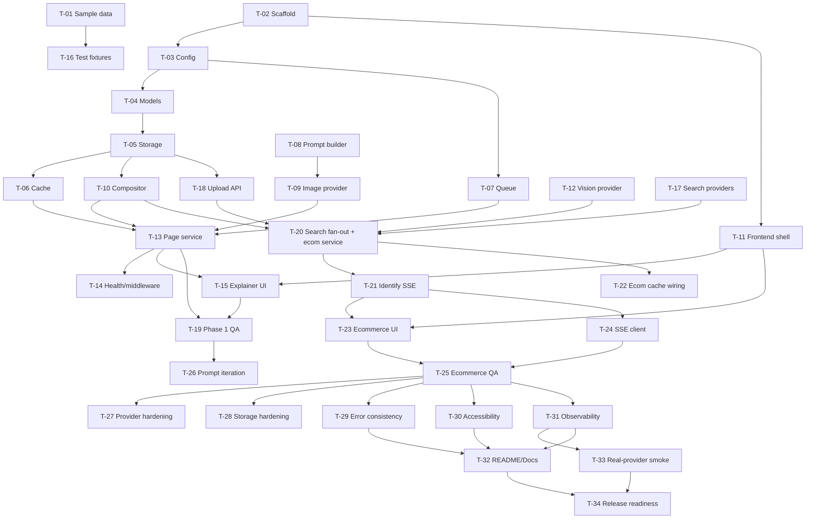

# DrillDown Implementation Plan

**Version:** 2.0
**Team:** 6 people — 4 Data Scientists (DS1–DS4) + 2 Full-Stack Python Engineers (FS1, FS2)
**Timeline:** 1 month (4 working weeks, ~20 working days)
**Default runtime:** Local development with Docker Compose (no cloud credentials required)
**Goal of this document:** Give every engineer branch-ready work with clear owners, reviewers, dependencies, day-level scheduling, branch names, commit messages, edge cases, and acceptance checklists — so the plan can be picked up and executed without further discussion.

---

## 1. Implementation Overview

### 1.1 Product Summary

DrillDown is a single web application with two user-facing variants that share the same "click on an image to drill in" interaction:

- **Explainer.** User enters a topic, gets an AI-generated watercolor illustration, then clicks any region to generate a deeper child illustration of that region. Works as an infinite hierarchical drill chain.
- **ShopTheLook.** User uploads or selects a fashion photo, clicks a garment, and receives an AI-identified item plus purchasable product matches streamed into a side panel.

Both variants reuse: red-ring marker compositing, content-addressed caching, serialized AI generation, and a shared frontend canvas.

### 1.2 Tech Stack (locked for this 1-month plan)

- **Backend:** Python 3.12, FastAPI, Uvicorn, Pydantic v2, `pydantic-settings`, Pillow, `structlog`, `slowapi`, `httpx`, `pytest`, `pytest-asyncio`.
- **Frontend:** React 18 + Vite + TypeScript.
- **Storage:** Local filesystem under `./data/generated/` (no S3, no DB, no Redis in MVP).
- **Runtime:** Docker Compose (one `server` container + one `client` container).
- **AI/Search:** External APIs (DALL·E or equivalent, GPT-4o vision or equivalent, one product-search provider) behind provider interfaces, with **mock providers shipped first**.

### 1.3 1-Month Timeline at a Glance

> Read this section first. It is the contract every engineer should follow.

#### Phase Calendar

| Week | Days | Phase | Exit Milestone |
|---|---|---|---|
| Week 1 | Day 1 – Day 5 | Foundation | Backend primitives ready (config, models, storage, cache, queue, compositor, prompt, image provider mock+real, vision provider stub). Frontend scaffold runs. |
| Week 2 | Day 6 – Day 10 | Explainer MVP | `POST /api/page` works end-to-end. User can type a topic, see a generated image, click to drill, and navigate. **Phase 1 sign-off.** |
| Week 3 | Day 11 – Day 15 | ShopTheLook MVP | `POST /api/identify` SSE streams identified item + product cards. Upload, click, panel, breadcrumbs work. **Phase 2 sign-off.** |
| Week 4 | Day 16 – Day 20 | Hardening & Release | Accessibility, error consistency, observability, real-provider smoke, final QA, README. **Release-ready local MVP.** |

#### Day-Level Engineer Schedule

Each cell shows the task IDs that engineer owns that day. Tasks span multiple days when needed; see Section 4 for full task definitions.

> **How to read "start" / "finish":** when a task depends on another that finishes the same day, **"start"** means scaffolding work that does not yet need the dependency (interface stubs, route signatures, fixtures), and **"finish"** means integrating once the dependency lands. Daily standups must confirm dependency landings before integration begins.

| Day | FS1 (Backend lead) | FS2 (Frontend / DevEx lead) | DS1 (Image-gen + prompts) | DS2 (Vision + search) | DS3 (Data plumbing) | DS4 (QA + observability) |
|---|---|---|---|---|---|---|
| Day 1 | T-03 start | T-02 | T-08 start | — (read briefs) | — (read briefs) | T-01 |
| Day 2 | T-03 finish | T-02 finish, T-11 start | T-08 finish, T-09 start | T-12 start | T-04 | T-01 finish |
| Day 3 | T-07 | T-11 | T-09 | T-12 | T-05 | T-16 start |
| Day 4 | T-07 finish, T-13 start | T-11 finish, T-15 start | T-10 start | T-12 finish | T-06 start | T-16 |
| Day 5 | T-13 | T-15 | T-10 finish | T-17 start | T-06 finish | T-16 finish |
| Day 6 | T-13 finish | T-15 | review | T-17 | T-22 start (cache wiring prep) | T-19 prep |
| Day 7 | T-14 | T-15 | T-26 start (prompt iter) | T-17 | T-22 | T-19 prep |
| Day 8 | T-14 finish, T-18 | T-15 finish | T-26 | T-17 finish | review | T-19 start |
| Day 9 | T-18 finish | T-24 start (SSE client integration spike, optional) | review | T-20 start | T-28 start (storage hardening prep) | T-19 |
| Day 10 | bugfix | bugfix | bugfix | bugfix | bugfix | T-19 finish, **Phase 1 sign-off** |
| Day 11 | T-21 start | T-23 start | T-26 finish | T-20 | T-22 finish | T-25 start |
| Day 12 | T-21 finish | T-23 | T-33 prep (real provider) | T-20 finish | review | T-25 |
| Day 13 | review | T-23 | review | T-27 start | T-22 (final wiring) | T-25 |
| Day 14 | review | T-23 finish, T-24 | review | T-27 | review | T-25 finish |
| Day 15 | bugfix | bugfix | bugfix | bugfix | bugfix | bugfix, **Phase 2 sign-off** |
| Day 16 | T-29 start | T-30 start | T-26 finish | T-27 finish | T-28 | T-31 start |
| Day 17 | T-29 finish | T-30 finish | T-33 | T-33 | T-28 finish | T-31 |
| Day 18 | T-32 start | T-32 (joint) | T-33 finish | T-33 finish | review | T-31 finish |
| Day 19 | T-32 finish | T-32 finish | review | review | review | T-34 start |
| Day 20 | release sign-off | release sign-off | review | review | review | T-34 finish, **Release-ready** |

#### Task ID → Title → Day → Owner Index

| ID | Title | Days | Owner | Reviewer | Branch |
|---|---|---|---|---|---|
| T-01 | Sample data + mock fixture plan | D1–D2 | DS4 | DS1 | `chore/t01-sample-data` |
| T-02 | Repo scaffold + Docker Compose | D1–D2 | FS2 | FS1 | `chore/t02-scaffold` |
| T-03 | Config, exceptions, structured logging | D1–D2 | FS1 | FS2 | `feat/t03-config-core` |
| T-04 | Pydantic models + API contracts | D2 | DS3 | FS1 | `feat/t04-api-models` |
| T-05 | Local storage + `BlobStore` interface | D3 | DS3 | FS1 | `feat/t05-local-storage` |
| T-06 | Cache manager + deterministic page IDs | D4–D5 | DS3 | FS1 | `feat/t06-cache-manager` |
| T-07 | Generation queue (serialized AI calls) | D3–D4 | FS1 | DS3 | `feat/t07-generation-queue` |
| T-08 | Prompt builder (style + child) | D1–D2 | DS1 | FS1 | `feat/t08-prompt-builder` |
| T-09 | Image generation provider (mock + real) | D2–D3 | DS1 | FS1 | `feat/t09-image-provider` |
| T-10 | Red-ring compositor (Pillow) | D4–D5 | DS1 | DS3 | `feat/t10-red-ring-compositor` |
| T-11 | Frontend scaffold + shell + API client | D2–D4 | FS2 | FS1 | `feat/t11-frontend-shell` |
| T-12 | Vision provider (mock + real) | D2–D4 | DS2 | DS1 | `feat/t12-vision-provider` |
| T-13 | Explainer page service + `POST /api/page` | D4–D6 | FS1 | DS3 | `feat/t13-page-service` |
| T-14 | Health, middleware, CORS, rate limit | D7–D8 | FS1 | FS2 | `feat/t14-health-middleware` |
| T-15 | Explainer UI components | D4–D8 | FS2 | DS4 | `feat/t15-explainer-ui` |
| T-16 | Backend test fixtures + integration tests | D3–D5 | DS4 | FS2 | `test/t16-fixtures` |
| T-17 | Product search providers (mock + real) | D5–D8 | DS2 | FS1 | `feat/t17-product-search` |
| T-18 | Image upload API (ecommerce prep) | D8–D9 | FS1 | DS3 | `feat/t18-upload-api` |
| T-19 | Phase 1 manual QA + bugfix coordination | D8–D10 | DS4 | FS1 | `test/t19-explainer-qa` |
| T-20 | Search fan-out + ecommerce service | D9–D12 | DS2 | FS1 | `feat/t20-search-fanout` |
| T-21 | Identify SSE router + ecommerce APIs | D11–D12 | FS1 | DS2 | `feat/t21-identify-sse` |
| T-22 | Vision + search cache wiring | D6–D13 | DS3 | DS2 | `feat/t22-ecom-cache` |
| T-23 | Ecommerce UI components | D11–D14 | FS2 | DS4 | `feat/t23-ecommerce-ui` |
| T-24 | Frontend SSE client + ecommerce wiring | D9, D14 | FS2 | FS1 | `feat/t24-sse-client` |
| T-25 | Ecommerce backend & frontend tests | D11–D14 | DS4 | DS2 | `test/t25-ecommerce-qa` |
| T-26 | Image-gen prompt iteration + style QA | D7–D16 | DS1 | DS2 | `chore/t26-prompt-tuning` |
| T-27 | Provider edge-case hardening | D13–D17 | DS2 | DS1 | `feat/t27-provider-hardening` |
| T-28 | Cache + storage hardening pass | D9–D17 | DS3 | FS1 | `feat/t28-storage-hardening` |
| T-29 | Error handling + status code consistency | D16–D17 | FS1 | FS2 | `fix/t29-error-consistency` |
| T-30 | Accessibility + responsive polish | D16–D17 | FS2 | DS4 | `feat/t30-accessibility` |
| T-31 | Observability + performance measurement | D16–D18 | DS4 | FS1 | `feat/t31-observability` |
| T-32 | Documentation + README + run instructions | D18–D19 | FS1+FS2 | DS4 | `docs/t32-readme` |
| T-33 | Real-provider smoke tests (image, vision, search) | D17–D18 | DS1+DS2 | FS1 | `test/t33-real-provider-smoke` |
| T-34 | Final QA + release readiness sign-off | D19–D20 | DS4 | FS1+FS2 | `test/t34-release-readiness` |

### 1.4 In-Scope vs Deferred (Important — read before starting)

To make 1 month realistic, the following items from the broader vision are **explicitly deferred to post-MVP** and must not be built during this plan:

| Deferred item | Reason |
|---|---|
| Drill-into-product details endpoint (`POST /api/drill-product`) | Requires extra UI + backend; not on the critical demo path. |
| "Shop This Look" full-photo overview with bounding boxes (`GET /api/look/{imageId}`) | Adds vision multi-detect complexity; single-click flow proves the concept. |
| Speculative pre-generation of next pages | Premature optimization; build only after baseline latency is measured. |
| Progressive blur-up image loading | Skeleton + ripple is enough for MVP perceived-speed targets. |
| Multiple parallel real image-gen providers | Ship 1 mock + 1 real adapter; provider interface keeps future swap cheap. |
| Multiple parallel real vision providers | Same: 1 mock + 1 real. |
| WebSocket transport (SSE only for MVP) | SSE covers all streaming needs in scope. |
| Deep accessibility audit (full WCAG AA) | Light pass only: keyboard nav, ARIA labels, contrast check. |
| Persistent user accounts, history, analytics | Out of MVP; no DB needed. |

### 1.5 Decision Principles

- Build the explainer first because it proves the shared red-ring + cache + storage + AI loop that ShopTheLook later reuses.
- Hide every external dependency behind an interface so providers can be swapped without touching business logic.
- No database, no cloud, no Redis. Local files plus an in-memory LRU are enough for MVP.
- Assign dependent tasks to the same engineer where practical. When dependency crosses frontend/backend, name one owner and one cross-discipline reviewer.
- Data scientists own ML behavior. Full-stack engineers own architecture, APIs, frontend, and runtime — they review ML integrations but do not own them.
- Mock providers ship first and are the default in CI. Real providers are tested manually with local `.env` keys.

---

## 2. Module Breakdown and Ownership

| Module | Owner | Reviewer | Why this owner |
|---|---|---|---|
| Repo scaffold, Docker Compose, CI | FS2 | FS1 | Needs full-stack dev-environment knowledge. |
| FastAPI app shell, dependency injection, routers | FS1 | FS2 | Core backend architecture. |
| Pydantic models and API contracts | DS3 | FS1 | Data shapes are Python-heavy and must stay consistent across services. |
| Local storage and `BlobStore` interface | DS3 | FS1 | Storage is data-focused and tightly coupled with cache behavior. |
| Cache manager and deterministic hashing | DS3 | FS1 | Cache correctness is data/invariant heavy. |
| Serialized generation queue | FS1 | DS3 | Affects API reliability and backend concurrency. |
| Red-ring compositor | DS1 | DS3 | Pillow work whose output directly drives ML behavior. |
| Prompt builder and style description | DS1 | FS1 | Prompt quality is ML-heavy but must obey backend security rules. |
| Image generation provider | DS1 | FS1 | ML-heavy API behavior and prompt iteration. |
| Vision provider | DS2 | DS1 | ML-heavy vision task. |
| Product search providers | DS2 | FS1 | External API behavior with backend contract review. |
| Search fan-out and ecommerce service | DS2 | FS1 | Same owner as search providers to avoid dependency split. |
| Explainer page service | FS1 | DS3 | Orchestrates cache, storage, prompt, queue, and provider. |
| Ecommerce routers and SSE | FS1 | DS2 | FastAPI streaming with AI-owner review. |
| React app shell, state, API client | FS2 | FS1 | Frontend state controls navigation and API interaction. |
| Explainer UI components | FS2 | DS4 | UI work needs full-stack skill plus QA review. |
| Ecommerce UI components | FS2 | DS4 | Same. |
| Test fixtures, mocks, manual QA | DS4 | FS2 | DS4 owns reproducible quality evidence. |
| Observability and performance checks | DS4 | FS1 | Needs data-driven measurements with backend log review. |
| Cache + storage hardening | DS3 | FS1 | Owner of cache + storage continues into hardening. |
| Provider edge-case hardening | DS2 | DS1 | Vision/search owner is closest to the failure modes. |

> **Single source of truth.** Compositor ownership is **DS1** (DS3 reviews). Earlier draft notes that said DS3 owns it are obsolete. Use this table.

---

## 3. Dependency and Interaction Map



### Integration Sequence (read top-down)

1. Repo, runtime, shared models, and configuration come first — everything else imports them.
2. Storage and cache before page generation — page IDs and local files are the foundation of idempotency.
3. Compositor before child-page generation and vision identification — both depend on the marked image.
4. Image generation before the explainer page service — the page service is the orchestrator.
5. Explainer UI after the page API contract is stable — frontend depends on a frozen response shape.
6. Vision and search providers before the ecommerce service — the service fans out to them.
7. SSE router before ecommerce UI — the UI consumes SSE event names defined in the router.
8. Hardening, accessibility, observability, real-provider smoke last — they assume the happy path is stable.

---

## 4. Part-Wise Implementation Plan

> Format for every task:
>
> - Header: ID, title, days, owner, reviewer, branch, commit message.
> - **Why it matters:** one-sentence reasoning.
> - **Subtasks:** checkboxes the owner ticks off as work completes.
> - **Edge cases:** must be explicitly handled or documented as deferred.
> - **Acceptance checklist:** the reviewer ticks these off before approving the PR.

### Week 1 — Foundation (Day 1 – Day 5)

---

#### T-01 Sample Data + Mock Fixture Plan

| Field | Value |
|---|---|
| Days | Day 1 – Day 2 |
| Owner | DS4 |
| Reviewer | DS1 |
| Depends on | — |
| Branch | `chore/t01-sample-data` |
| Commit | `chore(fixtures): add sample explainer prompts and fashion images for local testing` |

**Why it matters:** The team must not be blocked by API access. Stable mock outputs also make CI deterministic.

**Subtasks**

- [X] Add 5 sample explainer prompts to `server/tests/fixtures/explainer_prompts.json`.
- [ ] Add 10 sample fashion images (≤ 2 MB each) to `client/public/samples/` and `server/tests/fixtures/fashion/`.
- [ ] Document mock response shapes for image-gen, vision, and search providers.
- [ ] Cover happy path, no-item, provider-timeout, and empty-results cases in mock specs.

**Edge cases**

- Sample images larger than 2 MB → resize before committing.
- Fashion images with unclear garments → keep a deliberate mix of easy and hard.
- Sensitive imagery → exclude entirely; only royalty-free samples.

**Acceptance checklist**

- [ ] Sample files exist at the paths listed above.
- [ ] Mock spec doc lists all four cases per provider.
- [ ] No file in this PR exceeds 2 MB.

---

#### T-02 Repo Scaffold + Docker Compose

| Field | Value |
|---|---|
| Days | Day 1 – Day 2 |
| Owner | FS2 |
| Reviewer | FS1 |
| Depends on | — |
| Branch | `chore/t02-scaffold` |
| Commit | `chore(scaffold): add server, client, docker-compose, and env template` |

**Why it matters:** Every other task depends on a stable, reproducible local environment.

**Subtasks**

- [ ] Create `client/`, `server/`, `data/generated/`, `docs/` directory structure.
- [ ] Add `server/pyproject.toml` (or `requirements.txt`) pinning Python 3.12 and listed deps.
- [ ] Add React + Vite + TypeScript app under `client/` (Node 20 pinned in README).
- [ ] Add `docker-compose.yml` with `server` (port 8000) and `client` (port 5173) services and a `./data` volume mount.
- [ ] Add `.env.example`, `.gitignore` (excluding `.env`, `data/generated/`, `node_modules/`, `__pycache__/`).
- [ ] Add a placeholder `/health` route returning `{"status":"healthy"}`.
- [ ] Add GitHub Actions workflow that runs `pytest` (server) and `npm run build` (client).

**Edge cases**

- Node/Python version drift across machines → versions pinned in README and CI.
- `.env` accidentally committed → enforced via `.gitignore` plus PR review.
- `./data/generated/` deleted on container restart → volume mount tested manually.

**Acceptance checklist**

- [ ] `docker compose up` starts both services without error.
- [ ] `http://localhost:5173` shows the React placeholder.
- [ ] `http://localhost:8000/health` returns 200.
- [ ] `pytest` and `npm run build` succeed in CI.

---

#### T-03 Config, Exceptions, Structured Logging

| Field | Value |
|---|---|
| Days | Day 1 – Day 2 |
| Owner | FS1 |
| Reviewer | FS2 |
| Depends on | T-02 |
| Branch | `feat/t03-config-core` |
| Commit | `feat(config): add central settings, exception hierarchy, and structlog json logging` |

**Why it matters:** Configuration and errors must be consistent before feature work — otherwise each module invents its own pattern.

**Subtasks**

- [ ] Add `Settings` class using `pydantic-settings` reading from env / `.env`.
- [ ] Add settings: provider names, API keys, `STORAGE_DIR`, timeouts, `CACHE_MAX_ENTRIES`, `RATE_LIMIT_PER_MINUTE`, `APP_VERSION`, `CORS_ORIGINS`.
- [ ] Add exception hierarchy: `DrillDownError`, `ValidationError`, `ProviderError`, `ImageGenError`, `VisionError`, `SearchError`, `GenerationTimeoutError`, `StorageError`.
- [ ] Add `structlog` JSON setup with timestamp, level, request_id placeholder.
- [ ] Add unit tests for default settings and env overrides.

**Edge cases**

- Missing API key at startup must not crash the server; only the affected endpoint returns 503.
- Invalid numeric settings (e.g. `RATE_LIMIT_PER_MINUTE=abc`) must fail fast with a clear error.
- Logs must never include API keys or `.env` contents.

**Acceptance checklist**

- [ ] All config reads go through one `settings` object — no `os.getenv` calls elsewhere.
- [ ] Logs are valid JSON lines.
- [ ] Tests cover defaults and overrides.
- [ ] Missing key path returns 503, verified by test.

---

#### T-04 Pydantic Models + API Contracts

| Field | Value |
|---|---|
| Days | Day 2 |
| Owner | DS3 |
| Reviewer | FS1 |
| Depends on | T-03 |
| Branch | `feat/t04-api-models` |
| Commit | `feat(models): add request, domain, and response pydantic models` |

**Why it matters:** Stable contracts let backend, frontend, and tests work in parallel without collisions.

**Subtasks**

- [ ] Request models: `ClickCoordinates`, `PageRequest`, `IdentifyRequest`.
- [ ] Domain models: `Page`, `IdentifiedItem`, `ProductMatch`.
- [ ] Response models: `PageResponse`, `IdentifyEvent` (union for SSE), `HealthResponse`.
- [ ] Reject unknown fields (`model_config = ConfigDict(extra="forbid")`).
- [ ] Validate coordinate range `[0.0, 1.0]`.
- [ ] Validate `query` length 1–500 and trim whitespace.
- [ ] Unit tests for valid and invalid shapes.

**Edge cases**

- Empty/whitespace-only query → reject with 400.
- Coordinates negative, > 1, missing, or non-numeric → reject with 400.
- Request containing both `query` and `parentId` → reject as invalid.

**Acceptance checklist**

- [ ] Tests cover all listed edge cases.
- [ ] Field names match what frontend will consume (camelCase via `alias_generator` or documented mapping).
- [ ] Unknown fields are rejected.

---

#### T-05 Local Storage + `BlobStore` Interface

| Field | Value |
|---|---|
| Days | Day 3 |
| Owner | DS3 |
| Reviewer | FS1 |
| Depends on | T-04 |
| Branch | `feat/t05-local-storage` |
| Commit | `feat(storage): add blobstore interface and local atomic file storage` |

**Why it matters:** A local-first store with a clean interface keeps services storage-agnostic, which makes the future cloud move cheap.

**Subtasks**

- [ ] Define `BlobStore` ABC with `read(key)`, `write(key, bytes)`, `exists(key)`, `delete(key)`.
- [ ] Implement `LocalStorageClient` rooted at `STORAGE_DIR`.
- [ ] Implement atomic write: write to `*.tmp` then `os.replace`.
- [ ] Reject keys containing `..`, leading `/`, or null bytes.
- [ ] Unit tests for read, write, exists, delete, atomic-write, and path traversal.

**Edge cases**

- Missing file → `read` raises `StorageError` with cause `FileNotFoundError`.
- Zero-byte file → treated as missing/corrupt.
- Two concurrent writes to the same key → last-writer-wins via atomic rename.
- Disk-permission error → raise `StorageError` with original errno.
- `STORAGE_DIR` does not exist on first run → created lazily, not recreated on every restart.

**Acceptance checklist**

- [ ] All tests above pass.
- [ ] Path-traversal test asserts safe rejection.
- [ ] No code outside this module touches the filesystem directly.

---

#### T-06 Cache Manager + Deterministic Page IDs

| Field | Value |
|---|---|
| Days | Day 4 – Day 5 |
| Owner | DS3 |
| Reviewer | FS1 |
| Depends on | T-05 |
| Branch | `feat/t06-cache-manager` |
| Commit | `feat(cache): add deterministic page id hashing, lru memory cache, and disk metadata sidecars` |

**Why it matters:** Caching is the main cost and latency control. Deterministic IDs make every request idempotent.

**Subtasks**

- [ ] `compute_first_page_id(query)` = `sha256(normalize(query))[:16]`.
- [ ] `compute_child_page_id(parent_id, click)` = `sha256(parent_id + f"{round(x,4)}_{round(y,4)}")[:16]`.
- [ ] `normalize(query)` = strip + lowercase + collapse internal whitespace.
- [ ] `CacheManager` with `cachetools.LRUCache(maxsize=CACHE_MAX_ENTRIES)` for metadata.
- [ ] On miss, look up disk metadata JSON sidecar (`{id}.json`) before declaring miss.
- [ ] Write metadata sidecar atomically through `BlobStore`.
- [ ] Unit tests: same-input-same-id, casing/whitespace insensitivity, memory hit, disk hit, miss, eviction, corrupt-metadata-treated-as-miss.

**Edge cases**

- Same query in different casing → same ID (verified by test).
- Click coordinates rounding collisions are accepted and documented in the module docstring.
- Corrupt metadata JSON → log a warning and treat as miss.
- Cache evicts entry while disk file still exists → next request rebuilds from disk.

**Acceptance checklist**

- [ ] All tests above pass.
- [ ] No two distinct inputs produce the same ID in a 10k-input fuzz test.
- [ ] Cache hit path does not invoke any provider (verified by mock-call-count assertion).

---

#### T-07 Generation Queue (Serialized AI Calls)

| Field | Value |
|---|---|
| Days | Day 3 – Day 4 |
| Owner | FS1 |
| Reviewer | DS3 |
| Depends on | T-03 |
| Branch | `feat/t07-generation-queue` |
| Commit | `feat(queue): add serialized asyncio generation queue with timeout` |

**Why it matters:** Provider-side rate limits and local resource ceilings require us to serialize AI calls per process.

**Subtasks**

- [ ] `GenerationQueue` wrapping `asyncio.Lock` (or `Queue(maxsize=1)`).
- [ ] `submit(coro, timeout_s)` returning the result, applying `asyncio.wait_for`.
- [ ] Expose `pending_count` and `is_processing` for `/health`.
- [ ] Tests: tasks run serially, timeout raises `GenerationTimeoutError`, exceptions propagate cleanly.

**Edge cases**

- Coroutine raises → lock released, exception bubbles up.
- Timeout fires → raise `GenerationTimeoutError`; underlying coroutine is cancelled.
- Two callers wait simultaneously → second waits behind first, no deadlock.

**Acceptance checklist**

- [ ] Serial-execution test passes with two concurrent submissions.
- [ ] Timeout test passes.
- [ ] `pending_count`/`is_processing` reflect reality during a 1-second mock task.

---

#### T-08 Prompt Builder

| Field | Value |
|---|---|
| Days | Day 1 – Day 2 |
| Owner | DS1 |
| Reviewer | FS1 |
| Depends on | T-04 (interface ready in spec form Day 1) |
| Branch | `feat/t08-prompt-builder` |
| Commit | `feat(prompt): add watercolor style prompt and child prompt builders` |

**Why it matters:** Style consistency and prompt-injection safety both depend on disciplined prompt construction.

**Subtasks**

- [ ] Define `STYLE_DESCRIPTION` constant (watercolor, cohesive palette, no text in image).
- [ ] `build_first_prompt(query) -> str` that interpolates the user query into exactly one slot.
- [ ] `build_child_prompt() -> str` that instructs the model to drill into the red-ringed region and explicitly instructs **not** to render the red ring.
- [ ] Sanitize user query: strip markdown/code fences, collapse whitespace, hard-cap at 500 chars.
- [ ] Unit tests: style string appears, query appears once, child prompt contains red-ring exclusion, prompt-injection input does not break out of the slot.

**Edge cases**

- User enters prompt-injection text → kept inside the user slot, not interpreted as instruction.
- User enters URLs/code/special characters → preserved as text, not stripped (only formatting markers removed).
- Empty query → caller (validation layer) blocks before reaching this module.

**Acceptance checklist**

- [ ] Tests above pass.
- [ ] Prompt strings are pure constants/functions — no I/O.
- [ ] DS2 reviews to confirm the same conventions can extend to vision prompts.

---

#### T-09 Image Generation Provider (Mock + Real)

| Field | Value |
|---|---|
| Days | Day 2 – Day 3 |
| Owner | DS1 |
| Reviewer | FS1 |
| Depends on | T-08 |
| Branch | `feat/t09-image-provider` |
| Commit | `feat(image): add image generator interface, mock provider, and dalle adapter` |

**Why it matters:** A clean interface plus a mock unblocks every downstream task (page service, frontend, QA).

**Subtasks**

- [ ] `ImageGenerator` ABC with `async generate(prompt: str, reference: bytes | None) -> bytes`.
- [ ] `MockImageGenerator` returning a deterministic PNG (e.g. solid color + watermark).
- [ ] `DalleImageGenerator` (or whichever is available) using `httpx`, returning PNG bytes.
- [ ] Wrap provider exceptions in `ImageGenError`.
- [ ] Apply `IMAGE_GEN_TIMEOUT_S` per call.
- [ ] Selection happens via `IMAGE_GEN_PROVIDER` setting in DI factory.
- [ ] Unit tests with mocked HTTP.

**Edge cases**

- API key missing → factory returns provider stub that raises `ImageGenError("not configured")` on call.
- API timeout → raised as `GenerationTimeoutError`.
- Provider returns a URL → adapter downloads it and returns bytes.
- Provider returns unsupported format → raise `ImageGenError("unsupported format")`.
- Provider rate-limits → raise `ImageGenError("rate_limited", retryable=True)`.

**Acceptance checklist**

- [ ] Mock provider is byte-identical across calls with the same prompt.
- [ ] Real adapter is callable manually with a local `.env` key.
- [ ] All listed errors are wrapped consistently.

---

#### T-10 Red-Ring Compositor (Pillow)

| Field | Value |
|---|---|
| Days | Day 4 – Day 5 |
| Owner | DS1 |
| Reviewer | DS3 |
| Depends on | T-05 |
| Branch | `feat/t10-red-ring-compositor` |
| Commit | `feat(compositor): add pillow red ring overlay at normalized click coordinates` |

**Why it matters:** Models cannot reliably consume raw click coordinates. A visible marker tells the model what the user clicked.

**Subtasks**

- [ ] `RedRingCompositor.draw(image_bytes, click) -> bytes` using Pillow.
- [ ] Ring radius = `max(image.width, image.height) * 0.05`, stroke width 4 px, color `#FF0033`, plus 3-px center dot.
- [ ] Preserve original dimensions and format (PNG out).
- [ ] Unit tests sample pixel colors at expected ring location.
- [ ] Performance test: < 80 ms for a 1920×1080 image on a developer laptop.

**Edge cases**

- Click at corners `(0,0)` or `(1,1)` → ring is clipped but partial ring is still visible.
- Very small images (< 200 px) → ring scales down but stays visible (min radius 8 px).
- Non-image / corrupt bytes → raise `ValidationError("invalid image")`.
- Non-RGB images (CMYK, palette) → converted to RGB before drawing.

**Acceptance checklist**

- [ ] Pixel-sample test passes for at least 4 click positions.
- [ ] Performance test passes locally.
- [ ] Invalid input test asserts a clear error.

---

#### T-11 Frontend Scaffold + Shell + API Client

| Field | Value |
|---|---|
| Days | Day 2 – Day 4 |
| Owner | FS2 |
| Reviewer | FS1 |
| Depends on | T-02, T-04 |
| Branch | `feat/t11-frontend-shell` |
| Commit | `feat(frontend): add app shell, api client, shared types, and reducer state` |

**Why it matters:** Frontend needs a single API layer and a single state model before UI components are written.

**Subtasks**

- [ ] `client/src/types.ts` mirroring backend response models.
- [ ] `client/src/services/apiClient.ts` with typed `postPage`, `postIdentify` (SSE wrapper added in T-24).
- [ ] `client/src/stores/explorationReducer.ts` actions: `start`, `success`, `error`, `back`, `reset`, `jumpTo(index)`.
- [ ] App shell with variant selector placeholder (`Explainer` / `ShopTheLook`).
- [ ] Error boundary at app root.
- [ ] Unit tests for the reducer.

**Edge cases**

- Server unavailable → API client throws typed `NetworkError`, reducer transitions to `error` state.
- Slow request and user clicks repeatedly → reducer ignores actions while `loading === true`.
- Retry after failure → reducer supports `retry()` re-dispatching the last request.

**Acceptance checklist**

- [ ] Reducer tests cover all listed actions.
- [ ] API client centralizes base URL, timeouts, and error mapping.
- [ ] Variant switch updates shell without re-mount loops.

---

#### T-12 Vision Provider (Mock + Real)

| Field | Value |
|---|---|
| Days | Day 2 – Day 4 |
| Owner | DS2 |
| Reviewer | DS1 |
| Depends on | T-04, T-10 (interface only on Day 2; integration on Day 4) |
| Branch | `feat/t12-vision-provider` |
| Commit | `feat(vision): add vision analyzer interface, mock provider, and gpt4o adapter` |

**Why it matters:** Stream of work depends on a stable vision interface even before search providers exist.

**Subtasks**

- [ ] `VisionAnalyzer` ABC: `async identify(marked_image: bytes) -> IdentifiedItem | None`.
- [ ] Build vision prompt requesting category, color, pattern, brand cues, fabric — JSON-only output.
- [ ] `MockVisionAnalyzer` returning deterministic items including a `None` case for one fixture image.
- [ ] `GPT4oVisionAnalyzer` (or equivalent) adapter with `httpx`.
- [ ] Robust JSON parsing that tolerates code fences and surrounding prose.
- [ ] Apply `VISION_TIMEOUT_S` per call.
- [ ] Unit tests covering item-detected, no-item, malformed JSON, timeout, missing key.

**Edge cases**

- Model returns malformed JSON → retry once with stricter instruction; then return `None` and log.
- Model detects multiple items → pick the highest-confidence; document this rule in the module docstring.
- User clicked background → `None`.
- API timeout / missing key → mapped to `VisionError`.

**Acceptance checklist**

- [ ] Tests above pass.
- [ ] Vision logs never include the raw image bytes.
- [ ] DS1 reviews to confirm prompt safety conventions match T-08.

---

### Week 2 — Explainer MVP (Day 6 – Day 10)

---

#### T-13 Explainer Page Service + `POST /api/page`

| Field | Value |
|---|---|
| Days | Day 4 – Day 6 |
| Owner | FS1 |
| Reviewer | DS3 |
| Depends on | T-06, T-07, T-09, T-10 |
| Branch | `feat/t13-page-service` |
| Commit | `feat(page): add explainer page service orchestrating cache, queue, compositor, and provider` |

**Why it matters:** This is the core product loop. It wires every Week-1 primitive together.

**Subtasks**

- [ ] `PageService.handle_request(req)` implementing the flow in Section 7.
- [ ] First-page path: validate, compute ID, cache hit?, prompt build, queue-submit `image_gen.generate`, write image + metadata, return `PageResponse`.
- [ ] Child-page path: read parent image → composite ring → build child prompt → queue-submit `image_gen.generate(prompt, marked_parent)` → store → return.
- [ ] `POST /api/page` router calling the service.
- [ ] `GET /generated/*` static mount serving images from `STORAGE_DIR`.
- [ ] Integration test using mock provider: query → image, click → child image, repeat → cache hit (zero provider calls on second).

**Edge cases**

- Parent ID does not exist → 404 `parent_not_found`.
- Provider times out → 504 `generation_timeout`, no partial files left.
- Cache metadata exists but image file missing → treat as miss, regenerate, log warning.
- Disk write fails after provider succeeds → 500, no metadata sidecar written.
- Duplicate request while generation in progress → second request waits behind queue, then hits the now-warm cache.

**Acceptance checklist**

- [ ] Integration test passes end-to-end with mock provider.
- [ ] Same request twice → 1 provider call, verified via mock-call counter.
- [ ] All listed edge-case statuses are covered by tests.
- [ ] Generated images are served via `/generated/*` and load in a browser.

---

#### T-14 Health, Middleware, CORS, Rate Limit

| Field | Value |
|---|---|
| Days | Day 7 – Day 8 |
| Owner | FS1 |
| Reviewer | FS2 |
| Depends on | T-13 |
| Branch | `feat/t14-health-middleware` |
| Commit | `feat(api): add health endpoint, request id middleware, cors, rate limit, and exception handlers` |

**Why it matters:** Operational basics must exist before frontend integration so the frontend can rely on consistent error contracts.

**Subtasks**

- [ ] `GET /health` returning version, cache stats, queue stats.
- [ ] Request-ID middleware (UUID per request, attached to logs and response header `X-Request-Id`).
- [ ] CORS middleware reading `CORS_ORIGINS`.
- [ ] `slowapi` rate limit on AI endpoints (`POST /api/page`, `POST /api/identify`, `POST /api/upload`).
- [ ] Exception handlers mapping every custom error to a JSON body (see Section 12) with the right HTTP status.
- [ ] `/generated/*` excluded from rate limiting.

**Edge cases**

- Rate limit exceeded → 429 with `Retry-After` header.
- Unexpected exception → 500 with generic message, full stack only in logs.
- Frontend origin mismatch → preflight fails with clear message.
- Static image request → never rate-limited and never logged at INFO (DEBUG only).

**Acceptance checklist**

- [ ] `/health` returns documented shape (Section 15).
- [ ] All error responses share the schema in Section 12.
- [ ] Logs include request_id, endpoint, latency.
- [ ] Rate-limit test triggers 429 deterministically.

---

#### T-15 Explainer UI Components

| Field | Value |
|---|---|
| Days | Day 4 – Day 8 |
| Owner | FS2 |
| Reviewer | DS4 |
| Depends on | T-11, T-13 |
| Branch | `feat/t15-explainer-ui` |
| Commit | `feat(explainer-ui): add topic input, canvas, skeleton, ripple, red ring overlay, thumbnails, error state` |

**Why it matters:** This is what the user actually touches. The components convert the backend's deterministic loop into a feeling of immediate interactivity.

**Subtasks**

- [ ] `<TopicInput>` with submit on Enter; disabled while loading.
- [ ] `<ExplainerCanvas>` showing current image with click handler emitting normalized `[0..1]` coords.
- [ ] `<SkeletonLoader>` shimmer for new pages.
- [ ] `<RippleEffect>` instant ripple at click point.
- [ ] Client-side `<RedRingOverlay>` drawn at click point immediately (before backend response).
- [ ] `<ThumbnailStrip>` showing the drill chain; click jumps via `jumpTo`.
- [ ] `<ErrorState>` with retry button.
- [ ] Wire reducer ↔ components via context.

**Edge cases**

- Empty input on submit → submit button disabled.
- Very long query (>500 chars) → input enforces maxLength.
- Image not loaded yet and user clicks → ignore click.
- Click outside image bounds → ignore click.
- Small mobile viewport → canvas uses `aspect-ratio` and scales; thumbnails wrap.
- Broken generated image URL → `<ErrorState>` shown with retry.

**Acceptance checklist**

- [ ] Manual flow: type → see image → click → see child → back/reset/thumbnail jump all work.
- [ ] Click-then-immediate-feedback (ripple + red ring + skeleton) appears in < 50 ms.
- [ ] Error path is visible and retryable.
- [ ] All click handlers gated on `!loading`.

---

#### T-16 Backend Test Fixtures + Integration Tests

| Field | Value |
|---|---|
| Days | Day 3 – Day 5 |
| Owner | DS4 |
| Reviewer | FS2 |
| Depends on | T-01, T-04 |
| Branch | `test/t16-fixtures` |
| Commit | `test(fixtures): add pytest fixtures for storage, cache, mock providers, and fastapi test client` |

**Why it matters:** Reusable fixtures keep every later test fast, deterministic, and consistent.

**Subtasks**

- [ ] `tmp_storage` fixture pointing `STORAGE_DIR` at a `tmp_path`.
- [ ] `mock_image_gen`, `mock_vision`, `mock_search` fixtures returning controllable mocks.
- [ ] `client` fixture wrapping `TestClient(app)` with DI overrides for the mocks above.
- [ ] Fixture registry documented in `server/tests/README.md`.

**Edge cases**

- Fixture leakage between tests → each fixture function-scoped or explicitly reset.
- Mocks accidentally hit network → mocks raise if real `httpx` is invoked.

**Acceptance checklist**

- [ ] All fixtures are importable from `server/tests/conftest.py`.
- [ ] Sample test demonstrates each fixture.

---

#### T-17 Product Search Providers (Mock + Real)

| Field | Value |
|---|---|
| Days | Day 5 – Day 8 |
| Owner | DS2 |
| Reviewer | FS1 |
| Depends on | T-04 |
| Branch | `feat/t17-product-search` |
| Commit | `feat(search): add product searcher interface, mock provider, and one real adapter` |

**Why it matters:** Mock searcher unblocks the ecommerce frontend; the real adapter lets us prove the integration before Week 3.

**Subtasks**

- [ ] `ProductSearcher` ABC: `async search(item: IdentifiedItem) -> list[ProductMatch]`.
- [ ] `MockProductSearcher` returning 4–8 stable products per item, including one fixture that returns `[]`.
- [ ] One real adapter (e.g. Google Shopping or SerpAPI) using `httpx`.
- [ ] Normalize results: trim titles, validate URLs, fall back to placeholder thumbnail when missing.
- [ ] Apply `SEARCH_TIMEOUT_S` per provider call.
- [ ] Unit tests: happy path, empty results, duplicate items, timeout, missing optional fields.

**Edge cases**

- Provider returns no products → empty list, not error.
- Provider returns duplicates → deduped by `(title, retailer)`.
- Product missing price or thumbnail → still returned, with `None` for missing fields.
- Retailer URL invalid → product dropped with warning log.

**Acceptance checklist**

- [ ] Mock provider deterministic.
- [ ] Real adapter callable with local `.env` key.
- [ ] All listed edge cases covered by tests.

---

#### T-18 Image Upload API

| Field | Value |
|---|---|
| Days | Day 8 – Day 9 |
| Owner | FS1 |
| Reviewer | DS3 |
| Depends on | T-05, T-14 |
| Branch | `feat/t18-upload-api` |
| Commit | `feat(upload): add ecommerce image upload endpoint with type and size validation` |

**Why it matters:** ShopTheLook needs a stable, hashable local reference to the user's image.

**Subtasks**

- [ ] `POST /api/upload` accepting `multipart/form-data`.
- [ ] Validate MIME type (JPEG/PNG only) and size ≤ 5 MB.
- [ ] Hash bytes → `imageId`; store under `ecommerce/uploads/{imageId}.{ext}` via `BlobStore`.
- [ ] Response: `{ imageId, url }`.
- [ ] Integration test: upload, fetch via `/generated/*`, re-upload same bytes returns same `imageId`.

**Edge cases**

- Unsupported file type → 400.
- Oversize → 413.
- Corrupt image (Pillow fails to open) → 400.
- Duplicate upload → idempotent (same `imageId`).
- Path traversal via filename → ignored; the on-disk filename is `{imageId}.{ext}` only.

**Acceptance checklist**

- [ ] Tests cover all five edge cases.
- [ ] Same bytes → same ID across two requests.
- [ ] Endpoint is rate-limited.

---

#### T-19 Phase 1 Manual QA + Bugfix Coordination

| Field | Value |
|---|---|
| Days | Day 8 – Day 10 |
| Owner | DS4 |
| Reviewer | FS1 |
| Depends on | T-13, T-15 |
| Branch | `test/t19-explainer-qa` |
| Commit | `test(explainer): add phase 1 qa script, smoke checklist, and bug log` |

**Why it matters:** The explainer foundation must be solid because the ecommerce variant reuses every primitive.

**Subtasks**

- [ ] Run 10 drill chains (5 fresh topics × 2-deep drill) with mock and real providers.
- [ ] Tick the QA checklist: topic submit, drill click, ripple + ring + skeleton timing, navigation, retry on error, cache-hit speed.
- [ ] File bug tickets with reproduction steps; assign to owners.
- [ ] Track bug-fix PRs to merge by end of Day 10.
- [ ] Capture prompt-quality notes for DS1 to feed into T-26.

**Edge cases**

- Cache-hit performance regression → flag as P0 bug.
- Red ring leaks into model output → flag for prompt iteration (T-26).
- Drill chain loses watercolor style → flag for T-26.
- Navigation history inconsistent after error → P0.

**Acceptance checklist**

- [ ] Checklist filled in for all 10 chains.
- [ ] All P0/P1 bugs closed before sign-off.
- [ ] Sign-off note captured in `docs/qa/phase1.md`.

---

### Week 3 — ShopTheLook MVP (Day 11 – Day 15)

---

#### T-20 Search Fan-Out + Ecommerce Service

| Field | Value |
|---|---|
| Days | Day 9 – Day 12 |
| Owner | DS2 |
| Reviewer | FS1 |
| Depends on | T-12, T-17, T-10, T-06 |
| Branch | `feat/t20-search-fanout` |
| Commit | `feat(ecom): add search fan-out and ecommerce service yielding identify, product, and done events` |

**Why it matters:** Vision and search are tightly coupled; one owner avoids handoff confusion.

**Subtasks**

- [ ] `SearchFanOut.search(item)` running registered providers concurrently with `asyncio.gather(return_exceptions=True)`.
- [ ] Result merge + dedupe + simple ranking (price asc within same provider, then alternate across providers).
- [ ] `EcommerceService.identify_stream(image_id, click)` async generator yielding events: `identified`, `product` (one per match), `done`, or `no_item`.
- [ ] Vision result cached indefinitely under `hash(image_id, click)`.
- [ ] Search result cached for 24 h under `hash(item attributes)`.
- [ ] Unit tests for: vision-then-search, vision miss, one provider fails, all providers fail (still yields `done`), cached vision + expired search.

**Edge cases**

- Vision returns `None` → emit `no_item`, do not call search.
- One search provider raises → log, skip its results, continue.
- All providers raise → emit `done` with zero products.
- Cached vision exists but search expired → reuse vision, refresh search.
- Duplicate product across providers → dedupe by `(title, retailer)`.

**Acceptance checklist**

- [ ] All unit tests pass.
- [ ] Service is the only place that talks to vision + search providers.
- [ ] No business logic leaks into the router (T-21).

---

#### T-21 Identify SSE Router + Ecommerce APIs

| Field | Value |
|---|---|
| Days | Day 11 – Day 12 |
| Owner | FS1 |
| Reviewer | DS2 |
| Depends on | T-20 |
| Branch | `feat/t21-identify-sse` |
| Commit | `feat(ecom-api): add identify sse endpoint with disconnect handling` |

**Why it matters:** SSE turns slow fan-out latency into perceived speed by streaming products as they arrive.

**Subtasks**

- [ ] `POST /api/identify` returning `text/event-stream`.
- [ ] Each event line: `event: <name>\ndata: <json>\n\n` for `identified`, `product`, `done`, `no_item`, `error`.
- [ ] Cancel underlying task on `request.is_disconnected()`.
- [ ] Apply rate limiting and the standard error handler chain (return error event then close stream).
- [ ] Tests using `httpx.AsyncClient` to consume the stream and assert event order.

**Edge cases**

- Client disconnects mid-stream → background task is cancelled within 1 s; no orphan provider calls.
- Event payload contains special characters → JSON-encoded, never raw.
- Vision yields `no_item` → stream emits `no_item` then closes.
- Service raises mid-stream → emit `error` event, close.

**Acceptance checklist**

- [ ] SSE happy-path test passes.
- [ ] Disconnect test asserts task cancellation (via mock probe).
- [ ] Error event shape matches Section 12.

---

#### T-22 Vision + Search Cache Wiring

| Field | Value |
|---|---|
| Days | Day 6 – Day 13 (background work fitting around other tasks) |
| Owner | DS3 |
| Reviewer | DS2 |
| Depends on | T-06, T-12, T-17 |
| Branch | `feat/t22-ecom-cache` |
| Commit | `feat(cache): wire vision and search caches with separate ttls and namespaces` |

**Why it matters:** Two cache namespaces with different TTLs prevent stale search results without losing the deterministic vision result.

**Subtasks**

- [ ] Add `vision` namespace (no TTL) and `search` namespace (TTL = 24 h) to `CacheManager`.
- [ ] Disk paths: `ecommerce/cache/vision/{key}.json`, `ecommerce/cache/search/{key}.json`.
- [ ] TTL check on read: if expired, treat as miss and delete sidecar.
- [ ] Tests: write/read, expiry, namespace isolation, corrupt sidecar.

**Edge cases**

- Two namespaces with same key → never collide (verified by test).
- Expired entry on disk → cleaned up on next read.
- Sidecar corrupt → log, treat as miss.

**Acceptance checklist**

- [ ] Tests above pass.
- [ ] Cache hit vs miss is observable in logs.
- [ ] No code outside `CacheManager` knows about TTLs.

---

#### T-23 Ecommerce UI Components

| Field | Value |
|---|---|
| Days | Day 11 – Day 14 |
| Owner | FS2 |
| Reviewer | DS4 |
| Depends on | T-11, T-21 |
| Branch | `feat/t23-ecommerce-ui` |
| Commit | `feat(ecom-ui): add image uploader, gallery, ecom canvas, product panel, and breadcrumbs` |

**Why it matters:** This is the customer-facing surface for ShopTheLook.

**Subtasks**

- [ ] `<ImageUploader>` with drag-and-drop + file picker; preview before submit.
- [ ] `<SampleGallery>` showing `client/public/samples/` images.
- [ ] `<EcomCanvas>` reusing the click logic of `<ExplainerCanvas>`; emits normalized coords.
- [ ] `<ProductPanel>` opens on click, shows `<IdentifiedItemCard>`, then animated `<ProductCard>` stream.
- [ ] `<Breadcrumb>` for upload → click history.
- [ ] Empty-state UI for `no_item`.
- [ ] Loading shimmer + ripple on click (reused from explainer).

**Edge cases**

- Unsupported upload → inline error, no request.
- Click before image loads → ignored.
- Panel receives zero products after `done` → friendly empty message.
- Very long product names → CSS line-clamp 2.
- Mobile width → panel becomes a bottom sheet.

**Acceptance checklist**

- [ ] Manual flow: upload → click → identified card → cards stream in → click product opens new tab.
- [ ] No-item flow shows empty state.
- [ ] Panel is keyboard-openable and -closable (Esc).

---

#### T-24 Frontend SSE Client + Ecommerce Wiring

| Field | Value |
|---|---|
| Days | Day 9 (spike), Day 14 (integration) |
| Owner | FS2 |
| Reviewer | FS1 |
| Depends on | T-21, T-23 |
| Branch | `feat/t24-sse-client` |
| Commit | `feat(frontend): add sse client wrapper and ecommerce integration with reducer` |

**Why it matters:** SSE handling must be centralized so reconnection, cancellation, and event parsing are consistent.

**Subtasks**

- [ ] `apiClient.openIdentifyStream(req, handlers)` using `fetch` + `ReadableStream` (not `EventSource`, to allow POST).
- [ ] Parse `event:` and `data:` lines into typed callbacks: `onIdentified`, `onProduct`, `onDone`, `onNoItem`, `onError`.
- [ ] Cancel via `AbortController` when component unmounts or user clicks elsewhere.
- [ ] Reducer extension: `ecomStart`, `ecomIdentified`, `ecomProduct`, `ecomDone`, `ecomNoItem`, `ecomError`.
- [ ] Unit tests with a mocked stream.

**Edge cases**

- Stream closed by server before `done` → emit `onError`.
- User triggers a new identify before previous finishes → previous is aborted.
- Network drop mid-stream → emit `onError` after timeout, no auto-reconnect for MVP.

**Acceptance checklist**

- [ ] Reducer test with simulated event sequence passes.
- [ ] Manual abort test does not leak fetch handles.

---

#### T-25 Ecommerce Backend & Frontend Tests

| Field | Value |
|---|---|
| Days | Day 11 – Day 14 |
| Owner | DS4 |
| Reviewer | DS2 |
| Depends on | T-21, T-23 |
| Branch | `test/t25-ecommerce-qa` |
| Commit | `test(ecommerce): add backend integration and frontend manual qa for shopthelook` |

**Why it matters:** Ecommerce depends on multiple external services; coverage must include the failure modes, not just the happy path.

**Subtasks**

- [ ] Integration tests for `/api/identify` covering `identified+product+done`, `no_item`, partial provider failure, all-fail, disconnect.
- [ ] Integration tests for `/api/upload` covering accept/reject/oversize/corrupt/duplicate.
- [ ] Manual smoke checklist for: upload, gallery select, click, panel stream, no-item, mobile layout, Esc-closes-panel.
- [ ] Run 10 fashion images through the flow with mocks; record perceived behavior in `docs/qa/phase2.md`.
- [ ] Track bugs to closure by Day 15.

**Edge cases**

- Vision misidentification → recorded for T-26 prompt iteration.
- Provider rate limit on real run → recorded for T-27 hardening.
- SSE stream interrupted by browser → frontend shows error and allows retry.

**Acceptance checklist**

- [ ] All listed tests pass in CI with mocks.
- [ ] Manual checklist filled in for 10 images.
- [ ] Sign-off note captured in `docs/qa/phase2.md`.

---

### Week 4 — Hardening & Release (Day 16 – Day 20)

---

#### T-26 Image-Gen Prompt Iteration + Style QA

| Field | Value |
|---|---|
| Days | Day 7 – Day 16 (background, then concentrated D11/D16) |
| Owner | DS1 |
| Reviewer | DS2 |
| Depends on | T-19 |
| Branch | `chore/t26-prompt-tuning` |
| Commit | `chore(prompt): tune watercolor style and child drill prompts based on qa findings` |

**Why it matters:** Prompt changes can both improve and destabilize behavior — they must be evidence-based.

**Subtasks**

- [ ] Review style consistency across 10 drill chains from T-19.
- [ ] Review red-ring leakage frequency.
- [ ] Tune `STYLE_DESCRIPTION` and `build_child_prompt` only when problems are consistent across ≥ 3 cases.
- [ ] Re-run the same 10 chains; before/after notes in `docs/qa/prompt-iter.md`.
- [ ] Freeze prompt strings before Day 17.

**Edge cases**

- Improvement on one topic, regression on another → prefer no change; document the tradeoff.
- Vision prompt drift → cross-check with DS2 before changing shared style language.

**Acceptance checklist**

- [ ] Before/after notes captured.
- [ ] Final prompts merged behind a single PR with no other code changes.
- [ ] Known limitations listed.

---

#### T-27 Provider Edge-Case Hardening

| Field | Value |
|---|---|
| Days | Day 13 – Day 17 |
| Owner | DS2 |
| Reviewer | DS1 |
| Depends on | T-25 |
| Branch | `feat/t27-provider-hardening` |
| Commit | `feat(providers): harden vision and search providers for timeouts, retries, and bad payloads` |

**Why it matters:** External APIs misbehave; a single retry plus consistent error mapping is enough for MVP and prevents demo-day failure.

**Subtasks**

- [ ] One retry on 5xx / timeout for vision and search adapters with jittered backoff (250–500 ms).
- [ ] Fallback to `MockVisionAnalyzer` only if `VISION_PROVIDER=mock`; never silently swap.
- [ ] Reject vision JSON missing required fields with one re-prompt before returning `None`.
- [ ] Search adapter: skip individual results that fail validation rather than failing the whole call.
- [ ] Tests for retry behavior, no-double-retry on 4xx, and re-prompt path.

**Edge cases**

- Provider returns 401 → no retry, raise `ProviderError("auth")`.
- Provider returns 429 → no retry, raise `ProviderError("rate_limited", retryable=True)`.
- Provider returns 500 → retry once, then raise.
- Re-prompt also fails → return `None` (vision) or `[]` (search).

**Acceptance checklist**

- [ ] Tests above pass.
- [ ] No silent provider swap in code paths other than `mock`.
- [ ] DS1 reviews the retry logic to keep behavior aligned with T-09.

---

#### T-28 Cache + Storage Hardening Pass

| Field | Value |
|---|---|
| Days | Day 9 – Day 17 (background, focused D16–D17) |
| Owner | DS3 |
| Reviewer | FS1 |
| Depends on | T-25 |
| Branch | `feat/t28-storage-hardening` |
| Commit | `fix(storage): harden path safety, partial writes, and cache eviction edges` |

**Why it matters:** Bugs in storage and cache silently corrupt the demo; a final pass closes the long tail.

**Subtasks**

- [ ] Add a corruption-recovery test: pre-seed a zero-byte image and assert regeneration.
- [ ] Add a path-traversal fuzz test (100 random unsafe keys → all rejected).
- [ ] Add a cache-eviction-under-pressure test (insert `CACHE_MAX_ENTRIES + 50`, assert disk-fallback hits).
- [ ] Add a `du`-style helper script `scripts/disk_usage.py` printing per-namespace bytes.
- [ ] Document cleanup procedure in `docs/ops/local-data.md`.

**Edge cases**

- Disk full → write fails cleanly with `StorageError`; service returns 500 with stable error body.
- Two processes writing the same key (rare in dev) → atomic rename guarantees no torn file.

**Acceptance checklist**

- [ ] All hardening tests pass.
- [ ] Doc explains how to inspect and clean local data.

---

#### T-29 Error Handling + Status Code Consistency

| Field | Value |
|---|---|
| Days | Day 16 – Day 17 |
| Owner | FS1 |
| Reviewer | FS2 |
| Depends on | T-25 |
| Branch | `fix/t29-error-consistency` |
| Commit | `fix(api): unify error response shape and status codes across all endpoints` |

**Why it matters:** Frontend error UX is only as good as the contract; this PR locks the contract.

**Subtasks**

- [ ] Audit every endpoint and confirm errors match the schema in Section 12.
- [ ] Confirm correct statuses: 400, 404, 413, 429, 500, 502, 503, 504.
- [ ] Add a contract test asserting every documented error returns the expected shape.
- [ ] Update API docs section in README.

**Edge cases**

- Non-JSON request body → 400 with the shared error shape.
- Validation error from Pydantic → mapped to 400 with first violation in `error` field.

**Acceptance checklist**

- [ ] Contract test passes for every endpoint.
- [ ] Frontend (`apiClient`) parses every documented status without throwing.

---

#### T-30 Accessibility + Responsive Polish

| Field | Value |
|---|---|
| Days | Day 16 – Day 17 |
| Owner | FS2 |
| Reviewer | DS4 |
| Depends on | T-25 |
| Branch | `feat/t30-accessibility` |
| Commit | `feat(a11y): add aria labels, keyboard nav, and responsive fixes for both variants` |

**Why it matters:** Light-touch accessibility is cheap and removes obvious blockers; full audit is post-MVP.

**Subtasks**

- [ ] Buttons, inputs, thumbnails, canvas, product cards reachable by Tab.
- [ ] `aria-label` on icon-only buttons; `role="status"` on loading states.
- [ ] Esc closes the product panel; focus restored to trigger.
- [ ] Contrast check (Lighthouse) on primary text/button states.
- [ ] Mobile viewport test (375×667 and 414×896): no horizontal scroll, panel becomes bottom sheet.

**Edge cases**

- Keyboard user cannot click an exact image region → provide a fallback "drill into center" button on focused image.
- Focus trap in product panel correctly restores on close.

**Acceptance checklist**

- [ ] Lighthouse accessibility ≥ 90 on both variants.
- [ ] Manual keyboard-only walkthrough completes both flows.

---

#### T-31 Observability + Performance Measurement

| Field | Value |
|---|---|
| Days | Day 16 – Day 18 |
| Owner | DS4 |
| Reviewer | FS1 |
| Depends on | T-25 |
| Branch | `feat/t31-observability` |
| Commit | `feat(obs): add structured request metrics and performance measurement scripts` |

**Why it matters:** Without numbers we cannot tell whether the MVP meets its perceived-speed goals.

**Subtasks**

- [ ] Ensure every request log carries `request_id`, `endpoint`, `cache_hit`, `provider`, `provider_latency_ms`, `total_latency_ms`, `error_type` when applicable.
- [ ] `scripts/measure_explainer.py` running 20 mock + 5 real requests, printing P50/P95.
- [ ] `scripts/measure_ecom.py` running 10 identify flows, printing time-to-first-product.
- [ ] Document baseline numbers in `docs/perf/baseline.md`.
- [ ] Audit logs to confirm no API keys or raw image bytes appear.

**Edge cases**

- Logs exceed reasonable size → cap message bodies.
- Provider latency dominates → noted in baseline doc as expected.

**Acceptance checklist**

- [ ] Sample log line in `docs/perf/baseline.md`.
- [ ] Baseline P50/P95 captured.
- [ ] Secrets scan on log file passes.

---

#### T-32 Documentation + README + Run Instructions

| Field | Value |
|---|---|
| Days | Day 18 – Day 19 |
| Owner | FS1 + FS2 (joint) |
| Reviewer | DS4 |
| Depends on | T-29, T-30, T-31 |
| Branch | `docs/t32-readme` |
| Commit | `docs(readme): add complete local setup, env reference, run, and troubleshooting guide` |

**Why it matters:** A new engineer must be able to clone and run the app from the README only.

**Subtasks**

- [ ] Top-level `README.md` with sections: prerequisites, setup, env vars, run with Docker, run without Docker, common errors, scripts.
- [ ] `docs/api.md` listing every endpoint, request/response schema, status codes, error schema.
- [ ] `docs/architecture.md` summarizing module map and request flow (1 page, code-level only — no design rationale).
- [ ] `docs/ops/local-data.md` (already created in T-28) linked from README.

**Edge cases**

- New engineer skips `.env.example` step → README puts it as step 1 with explicit copy command.
- Docker not installed → README documents the non-Docker path with `uv` or `python -m venv`.

**Acceptance checklist**

- [ ] DS4 follows README on a clean directory and the app runs.
- [ ] All endpoints documented match the contract test from T-29.

---

#### T-33 Real-Provider Smoke Tests

| Field | Value |
|---|---|
| Days | Day 17 – Day 18 |
| Owner | DS1 (image-gen) + DS2 (vision, search) |
| Reviewer | FS1 |
| Depends on | T-27 |
| Branch | `test/t33-real-provider-smoke` |
| Commit | `test(real-providers): add manual smoke script for image, vision, and search adapters` |

**Why it matters:** Mocks lie. We need at least one real-API run per provider before sign-off.

**Subtasks**

- [ ] `scripts/smoke_real_providers.py` running 1 explainer chain (depth 2), 1 identify flow, with real keys.
- [ ] Capture failures (rate limit, auth, format) in `docs/qa/real-providers.md`.
- [ ] Confirm error mapping from T-27 fires correctly when keys are intentionally invalidated.
- [ ] Confirm budgets: total cost per run is documented.

**Edge cases**

- Provider seasonally unavailable → noted; demo falls back to mock.
- Provider returns NSFW or wildly off-topic image → noted, prompt iteration follow-up.

**Acceptance checklist**

- [ ] Smoke script runs to completion at least once with each provider.
- [ ] Findings logged.

---

#### T-34 Final QA + Release Readiness Sign-Off

| Field | Value |
|---|---|
| Days | Day 19 – Day 20 |
| Owner | DS4 |
| Reviewer | FS1 + FS2 |
| Depends on | T-29, T-30, T-31, T-32, T-33 |
| Branch | `test/t34-release-readiness` |
| Commit | `test(release): final qa checklist and sign-off note for local mvp` |

**Why it matters:** This is the contract that the MVP is done.

**Subtasks**

- [ ] Run the full QA checklist (Phase 1 + Phase 2 + accessibility + performance + real-provider smoke).
- [ ] Verify Definition of Done (Section 19) for every merged task.
- [ ] Verify on a clean clone that `docker compose up` reaches both flows in < 10 minutes.
- [ ] Capture sign-off note in `docs/release/v1.0.md`.

**Edge cases**

- Hidden assumption (e.g. requires a non-default env var) → blocker; fix and re-run.
- Real-provider key expired → mock fallback documented in release note.

**Acceptance checklist**

- [ ] All tasks T-01 → T-33 are merged and green.
- [ ] Release note merged.
- [ ] Both leads (FS1, FS2) approve.

---

## 5. Sprint/Milestone Plan

| Week | Days | Milestone | Owners on the critical path | Exit Gate (must all be true) |
|---|---|---|---|---|
| Week 1 | Day 1 – Day 5 | Foundation | FS1, FS2, DS1, DS2, DS3, DS4 | T-01..T-12 merged; backend boots; frontend serves; `pytest` and `npm run build` green. |
| Week 2 | Day 6 – Day 10 | Explainer MVP | FS1, FS2, DS3, DS4 | T-13..T-19 merged; mock-provider drill chain works in browser; cache-hit test green; Phase 1 sign-off in `docs/qa/phase1.md`. |
| Week 3 | Day 11 – Day 15 | ShopTheLook MVP | FS1, FS2, DS2, DS3, DS4 | T-20..T-25 merged; SSE identify flow works in browser end-to-end; Phase 2 sign-off in `docs/qa/phase2.md`. |
| Week 4 | Day 16 – Day 20 | Hardening & Release | All | T-26..T-34 merged; Lighthouse a11y ≥ 90; baseline perf captured; real-provider smoke run; release note in `docs/release/v1.0.md`. |

### Daily Standup Format (15 minutes)

- Yesterday: which task IDs progressed, which subtasks were ticked.
- Today: which task IDs and subtasks.
- Blockers: list (PR review waiting, mock fixture missing, API key not yet provisioned, etc.).

---

## 6. Detailed Task List by Module (Cross-Reference)

This is a compact lookup grouped by module. Full task definitions live in Section 4.

### Backend Core

- [ ] T-03 Config, exceptions, logging — FS1 / FS2 — `feat/t03-config-core`
- [ ] T-04 Pydantic models — DS3 / FS1 — `feat/t04-api-models`
- [ ] T-05 Local storage — DS3 / FS1 — `feat/t05-local-storage`
- [ ] T-06 Cache manager — DS3 / FS1 — `feat/t06-cache-manager`
- [ ] T-07 Generation queue — FS1 / DS3 — `feat/t07-generation-queue`
- [ ] T-10 Red-ring compositor — DS1 / DS3 — `feat/t10-red-ring-compositor`
- [ ] T-22 Ecom cache wiring — DS3 / DS2 — `feat/t22-ecom-cache`
- [ ] T-28 Storage hardening — DS3 / FS1 — `feat/t28-storage-hardening`

### AI and Search

- [ ] T-08 Prompt builder — DS1 / FS1 — `feat/t08-prompt-builder`
- [ ] T-09 Image provider — DS1 / FS1 — `feat/t09-image-provider`
- [ ] T-12 Vision provider — DS2 / DS1 — `feat/t12-vision-provider`
- [ ] T-17 Product search — DS2 / FS1 — `feat/t17-product-search`
- [ ] T-20 Search fan-out + ecom service — DS2 / FS1 — `feat/t20-search-fanout`
- [ ] T-26 Prompt iteration — DS1 / DS2 — `chore/t26-prompt-tuning`
- [ ] T-27 Provider hardening — DS2 / DS1 — `feat/t27-provider-hardening`

### APIs

- [ ] T-13 Page service + `/api/page` — FS1 / DS3 — `feat/t13-page-service`
- [ ] T-14 Health + middleware — FS1 / FS2 — `feat/t14-health-middleware`
- [ ] T-18 Upload API — FS1 / DS3 — `feat/t18-upload-api`
- [ ] T-21 Identify SSE — FS1 / DS2 — `feat/t21-identify-sse`
- [ ] T-29 Error consistency — FS1 / FS2 — `fix/t29-error-consistency`

### Frontend

- [ ] T-02 Scaffold — FS2 / FS1 — `chore/t02-scaffold`
- [ ] T-11 App shell + API client — FS2 / FS1 — `feat/t11-frontend-shell`
- [ ] T-15 Explainer UI — FS2 / DS4 — `feat/t15-explainer-ui`
- [ ] T-23 Ecommerce UI — FS2 / DS4 — `feat/t23-ecommerce-ui`
- [ ] T-24 SSE client + ecom wiring — FS2 / FS1 — `feat/t24-sse-client`
- [ ] T-30 Accessibility polish — FS2 / DS4 — `feat/t30-accessibility`

### QA, Observability, Release

- [ ] T-01 Sample data — DS4 / DS1 — `chore/t01-sample-data`
- [ ] T-16 Test fixtures — DS4 / FS2 — `test/t16-fixtures`
- [ ] T-19 Phase 1 QA — DS4 / FS1 — `test/t19-explainer-qa`
- [ ] T-25 Phase 2 QA — DS4 / DS2 — `test/t25-ecommerce-qa`
- [ ] T-31 Observability — DS4 / FS1 — `feat/t31-observability`
- [ ] T-32 README + docs — FS1+FS2 / DS4 — `docs/t32-readme`
- [ ] T-33 Real-provider smoke — DS1+DS2 / FS1 — `test/t33-real-provider-smoke`
- [ ] T-34 Release readiness — DS4 / FS1+FS2 — `test/t34-release-readiness`

---

## 7. Pseudocode for Critical Paths

### 7.1 Explainer Page Service (T-13)

```text
async def handle_page_request(req):
    validate(req)                                    # T-04
    if req.query is not None:
        page_id = compute_first_page_id(req.query)   # T-06
    else:
        page_id = compute_child_page_id(req.parent_id, req.click)

    cached = cache.get("pages", page_id)
    if cached and storage.exists(cached.image_path):
        return PageResponse.from_cache(cached)

    async with generation_queue:                     # T-07
        if req.query is not None:
            prompt = build_first_prompt(req.query)   # T-08
            image_bytes = await image_gen.generate(prompt)
        else:
            parent_bytes = storage.read(parent_image_path(req.parent_id))
            marked = compositor.draw(parent_bytes, req.click)        # T-10
            prompt = build_child_prompt()
            image_bytes = await image_gen.generate(prompt, marked)

        storage.write(image_path(page_id), image_bytes)              # T-05
        cache.put("pages", page_id, metadata)                        # T-06
        return PageResponse(...)
```

### 7.2 Ecommerce Identify Stream (T-20 + T-21)

```text
async def identify_stream(image_id, click):
    image_bytes = storage.read(upload_path(image_id))
    marked = compositor.draw(image_bytes, click)

    vkey = hash(image_id, click)
    item = cache.get("vision", vkey)
    if item is None:
        item = await vision.identify(marked)         # T-12
        if item is None:
            yield event("no_item")
            return
        cache.put("vision", vkey, item)              # no ttl

    yield event("identified", item)

    skey = hash(item.attributes())
    products = cache.get("search", skey)
    if products is None:
        products = await search_fanout.search(item)  # T-17 + T-20
        cache.put("search", skey, products, ttl=24h)

    for p in products:
        yield event("product", p)
    yield event("done")
```

### 7.3 Frontend Drill Interaction (T-15 / T-23 / T-24)

```text
function onImageClick(event):
    if !currentImage or state.loading:
        return
    click = normalize(event.x, event.y)              # 0..1
    showRipple(click)
    showClientRedRing(click)
    showSkeleton()

    if mode == "explainer":
        request POST /api/page with { parentId, click }
        on success: dispatch(success(newPage))
        on error:   dispatch(error(err))
    else:
        openIdentifyStream({ imageId, click }, {
            onIdentified: dispatch(ecomIdentified),
            onProduct:    dispatch(ecomProduct),
            onDone:       dispatch(ecomDone),
            onNoItem:     dispatch(ecomNoItem),
            onError:      dispatch(ecomError),
        })
```

---

## 8. Test Strategy and Test Matrix

### 8.1 Test Types

| Type | Owner | Scope | Required before merge? |
|---|---|---|---|
| Unit | Task owner | Pure functions, classes, reducers | Yes for backend logic and reducers. |
| Integration | Owner + reviewer | API endpoints with DI-overridden mock providers | Yes for any new endpoint. |
| Contract | FS1 + FS2 | Request/response shapes shared between FE and BE | Yes once T-29 lands. |
| Manual smoke | DS4 | End-to-end browser flows | Yes per milestone (T-19, T-25, T-34). |
| Performance | DS4 | Cache hit, compositing, provider latency, time-to-first-product | Required before T-34 sign-off. |

### 8.2 Requirement-to-Test Matrix

| Area | Unit | Integration | Smoke | Edge cases |
|---|---|---|---|---|
| Topic input | Query validation | `POST /api/page` query flow | Type topic → see image | Empty, long, whitespace |
| Drill click | Coord normalization, reducer | Parent click request | Click image → see child | Corners, missing parent |
| Red ring | Pixel sample | Page service uses marked image | Visual ring instant | Small/corrupt image |
| Caching | Hashing, LRU, TTL | Repeated request skips provider | Same topic is fast | Corrupt sidecar, missing image |
| Navigation | Reducer | — | Back, reset, jump | Jump after error |
| Vision | JSON parse | `/api/identify` first event | Click garment → identified card | No item, malformed JSON |
| Search | Normalize, dedupe | Fan-out service | Cards stream in | Provider failure, duplicates |
| SSE | Event encoder | Stream endpoint | Cards appear progressively | Disconnect, error event |
| Upload | Validation | `/api/upload` | Uploaded image displays | Unsupported, oversize, duplicate |

### 8.3 Mocking Rules

- CI runs **mock providers only**.
- Real providers are exercised manually under T-33 with local `.env` keys.
- Mock image-gen returns a deterministic PNG.
- Mock vision covers item / no-item / malformed cases.
- Mock search covers products / empty / timeout / duplicate cases.

---

## 9. Abstraction and Provider-Agnostic Design

| Interface | Module | First implementation | Future swap |
|---|---|---|---|
| `BlobStore` | `server/app/storage/` | `LocalStorageClient` | S3 / GCS client |
| `ImageGenerator` | `server/app/providers/` | `MockImageGenerator`, `DalleImageGenerator` | Flux / SDXL |
| `VisionAnalyzer` | `server/app/providers/` | `MockVisionAnalyzer`, `GPT4oVisionAnalyzer` | Claude / Gemini |
| `ProductSearcher` | `server/app/providers/` | `MockProductSearcher`, one real adapter | Amazon / ViSenze / retailer APIs |

### Adapter Rules (non-negotiable)

- Services depend only on interfaces, never on SDK classes.
- Provider SDK / `httpx` calls live only inside provider adapter files.
- Adapters convert all external errors into `ProviderError` subclasses.
- Adapters never return raw provider response objects to routers.
- Provider selection happens in one DI factory, driven by `*_PROVIDER` env settings.

---

## 10. Data Migration Plan

No database migrations exist for the MVP.

### Local Data Layout

```
data/generated/
  pages/{pageId}.png
  pages/{pageId}.json                # metadata sidecar
  ecommerce/uploads/{imageId}.{ext}
  ecommerce/cache/vision/{key}.json
  ecommerce/cache/search/{key}.json
```

### Rules

- The app **never** deletes or recreates `data/generated/` on startup.
- New folders are created lazily on first write.
- Cleanup is manual via `scripts/disk_usage.py` and the `docs/ops/local-data.md` runbook.

### Future Cloud Migration (post-MVP)

1. Implement an `S3BlobStore` against the existing `BlobStore` interface.
2. One-time copy of `data/generated/` to the bucket.
3. Flip `STORAGE_BACKEND` config and restart.
4. Run cache-hit and image-serving smoke tests (T-31 scripts).

Rollback = flip the config back and use the local folder again.

---

## 11. Boilerplate and Project Scaffolding Standards

### Backend Standards

- Python 3.12, FastAPI, Uvicorn, Pydantic v2.
- `pydantic-settings` for config.
- Pillow for image compositing.
- `structlog` for JSON logs.
- `pytest` + `pytest-asyncio` for tests.
- Type hints on every public function.
- `ruff` for lint, `black` for format (configured in `pyproject.toml`).

### Frontend Standards

- React 18 + Vite + TypeScript.
- One API client module — no `fetch` calls scattered in components.
- Reducer-based state for drill navigation.
- CSS modules for component styles; no UI framework dependency in MVP.
- ESLint + Prettier.

### Repository Layout

```text
server/app/
  core/        # config, logging, exceptions
  models/      # pydantic models
  providers/   # image, vision, search adapters
  routers/     # fastapi routers
  services/    # page service, ecommerce service, fan-out
  storage/     # blobstore + local impl
  cache/       # cache manager
  main.py

server/tests/
  fixtures/
  unit/
  integration/
  conftest.py

client/src/
  components/
  hooks/
  services/    # api client, sse client
  stores/      # reducers
  styles/
  types.ts

data/generated/      # gitignored
docs/                # plan, qa, ops, perf, release
scripts/             # measurement, smoke, disk usage
```

---

## 12. Error Handling and Logging Standards

### Error Response Schema (every endpoint, every error)

```json
{
  "error": "generation_timeout",
  "message": "Image generation exceeded 30s.",
  "retryable": true,
  "requestId": "req_abc123"
}
```

### Status Code Mapping

| Condition | Status |
|---|---|
| Validation failure | 400 |
| Resource not found (e.g. parentId) | 404 |
| Upload too large | 413 |
| Rate limit exceeded | 429 |
| Unexpected bug | 500 |
| Provider unavailable | 502 |
| Provider not configured (missing key) | 503 |
| Provider / generation timeout | 504 |

### Logging Rules

Every request log must include:

- `request_id`
- `endpoint`
- `cache_hit` (bool)
- `provider` (if applicable)
- `provider_latency_ms` (if applicable)
- `total_latency_ms`
- `error_type` (when applicable)

Logs must **never** contain API keys, raw uploaded image bytes, or full prompts.

---

## 13. Configuration and Secrets Strategy

### `.env` Reference (committed as `.env.example`)

```bash
# Provider selection
IMAGE_GEN_PROVIDER=mock        # mock | dalle
VISION_PROVIDER=mock           # mock | gpt4o
SEARCH_PROVIDER=mock           # mock | <real-name>

# API keys (leave blank for mock mode)
OPENAI_API_KEY=
ANTHROPIC_API_KEY=
GOOGLE_SHOPPING_API_KEY=

# Storage
STORAGE_DIR=./data/generated

# Cache
CACHE_MAX_ENTRIES=500

# Timeouts (seconds)
IMAGE_GEN_TIMEOUT_S=30
VISION_TIMEOUT_S=15
SEARCH_TIMEOUT_S=10

# Limits
RATE_LIMIT_PER_MINUTE=10
APP_VERSION=1.0.0

# CORS
CORS_ORIGINS=http://localhost:5173
```

### Rules

- `.env` is local and gitignored.
- `.env.example` is committed and is the source of truth for variable names.
- Code reads settings only from the central `Settings` object.
- Mock providers must be the default, so the app runs without any real keys.
- Secrets must never appear in logs, frontend bundles, screenshots, or commits.

---

## 14. Statelessness and Idempotency Plan

### Statelessness

- Backend keeps **no per-user session state** in process memory.
- Frontend stores navigation history in local React state only.
- Durable content is files on disk under `data/generated/`.
- The in-memory cache is an optimization layer and is fully rebuildable from disk.

### Idempotency Guarantees

- Same topic → same page ID.
- Same `(parent_id, rounded click)` → same child page ID.
- Same `(image_id, rounded click)` → same vision cache key.
- Same item attributes → same search cache key (within 24-hour TTL).

### Edge Cases

- Image file missing but metadata exists → treat as cache miss, regenerate.
- Metadata corrupt → log warning, regenerate.
- Two concurrent identical requests → second waits behind the queue and returns the warm cache.

---

## 15. Containerization and Health Checks

### Local Runtime

- `server` container: FastAPI on port 8000.
- `client` container: Vite dev server on port 5173.
- `./data` mounted into the server container at `/app/data`.
- No cloud credentials required to run.

### `/health` Response Shape

```json
{
  "status": "healthy",
  "version": "1.0.0",
  "cache": {
    "memoryEntries": 0,
    "maxEntries": 500
  },
  "queue": {
    "pending": 0,
    "processing": false
  }
}
```

### Health Edge Cases

- Empty cache → still healthy.
- Missing API key in mock mode → still healthy.
- `STORAGE_DIR` not writable → status `"unhealthy"` with reason `"storage_unwritable"`.

---

## 16. Git Branching and Merge Strategy

### Branching Model

Trunk-based with short-lived feature branches off `main`.

### Branch Naming

```text
feat/<task-id>-<short-name>      # new feature
fix/<task-id>-<short-name>       # bug fix
test/<task-id>-<short-name>      # test-only
docs/<task-id>-<short-name>      # docs-only
chore/<task-id>-<short-name>     # tooling/config/data
```

Examples (already used in Section 1.3):

- `feat/t05-local-storage`
- `feat/t13-page-service`
- `feat/t21-identify-sse`
- `test/t34-release-readiness`

### Merge Rules

- No direct push to `main`.
- Every branch opens a PR with at least one approving reviewer (the one named in the task).
- Squash merge into `main`.
- API or architecture PRs require FS1 review.
- Frontend PRs require FS2 review.
- ML / provider PRs require DS1 or DS2 review.

### PR Size

- Target: ≤ 400 changed lines excluding tests.
- If larger, split into interface PR → implementation PR → tests PR.

---

## 17. Commit Message Convention and Sample Commit Plan

Use Conventional Commits:

```text
type(scope): short description
```

### Allowed Types

| Type | Use |
|---|---|
| `feat` | New feature |
| `fix` | Bug fix |
| `test` | Tests only |
| `docs` | Documentation only |
| `chore` | Tooling, config, scaffolding, fixtures |
| `refactor` | No behavior change |

### Sample Commits (one per task; see Section 1.3 for the full list)

| Task | Commit |
|---|---|
| T-01 | `chore(fixtures): add sample explainer prompts and fashion images for local testing` |
| T-02 | `chore(scaffold): add server, client, docker-compose, and env template` |
| T-03 | `feat(config): add central settings, exception hierarchy, and structlog json logging` |
| T-05 | `feat(storage): add blobstore interface and local atomic file storage` |
| T-06 | `feat(cache): add deterministic page id hashing, lru memory cache, and disk metadata sidecars` |
| T-09 | `feat(image): add image generator interface, mock provider, and dalle adapter` |
| T-10 | `feat(compositor): add pillow red ring overlay at normalized click coordinates` |
| T-13 | `feat(page): add explainer page service orchestrating cache, queue, compositor, and provider` |
| T-15 | `feat(explainer-ui): add topic input, canvas, skeleton, ripple, red ring overlay, thumbnails, error state` |
| T-21 | `feat(ecom-api): add identify sse endpoint with disconnect handling` |
| T-23 | `feat(ecom-ui): add image uploader, gallery, ecom canvas, product panel, and breadcrumbs` |
| T-31 | `feat(obs): add structured request metrics and performance measurement scripts` |
| T-32 | `docs(readme): add complete local setup, env reference, run, and troubleshooting guide` |

### Commit Granularity

- One squash commit per PR.
- Implementation and its tests in the same PR when ≤ 400 lines.
- Never combine unrelated modules in one PR.

---

## 18. Rollout, Rollback, and Risk Mitigation

| Risk | Owner | Mitigation | Rollback |
|---|---|---|---|
| Image-gen API unavailable | DS1 | Mock provider as default; real provider behind `IMAGE_GEN_PROVIDER`. | Set `IMAGE_GEN_PROVIDER=mock`. |
| Vision model inaccurate | DS2 | Sample-image QA in T-25; document limitations in T-26. | Return `no_item` and let the user re-click. |
| Search API unavailable | DS2 | Mock searcher; real provider added incrementally. | Set `SEARCH_PROVIDER=mock`. |
| Local disk fills up | DS3 | `scripts/disk_usage.py`; cleanup runbook. | Delete `data/generated/` after backup. |
| Frontend state bug | FS2 | Reducer unit tests; smoke tests in T-19/T-25. | Revert frontend PR. |
| SSE stream unstable | FS1 | Disconnect test in T-21; abort handling in T-24. | Frontend retries; if persistent, fall back to a single combined response (post-MVP fix). |
| Prompt quality regressed | DS1 | Evidence-based change in T-26; before/after notes. | Revert the prompt-only PR. |
| Secret leaks into logs / bundle | FS1 | Log audit in T-31; pre-commit grep hook. | Rotate the key; rewrite history if necessary. |
| Plan slips into Week 5 | All | Defer items in 1.4; daily standup; cut scope before quality. | Move T-26/T-27/T-30 follow-ups to a v1.1 backlog. |

### Rollback Rules

- Revert the squash commit that introduced the regression.
- If a provider integration breaks, switch that provider to `mock` immediately.
- Frontend regressions must never destabilize the backend API contract.
- Corrupt local data → move `data/generated/` aside, regenerate from sample fixtures.

---

## 19. Definition of Done

A task is **done** only when **every** item below is true:

- [ ] Owner completed the work described in the task.
- [ ] All listed subtasks are checked.
- [ ] All listed edge cases are handled or explicitly documented as deferred.
- [ ] Unit / integration / smoke tests added per Section 8.
- [ ] The named reviewer approved the PR.
- [ ] CI is green.
- [ ] No secrets, no generated data, no `.env` committed.
- [ ] README / docs updated when setup, config, or behavior changed.
- [ ] Another engineer can run the task's feature locally from a clean checkout.

### Self-Review Checklist (run after every plan revision)

- [x] All 19 required planning sections present.
- [x] Team is exactly 4 data scientists + 2 full-stack Python engineers.
- [x] Every task has owner, reviewer, branch, commit message, and acceptance checklist.
- [x] ML-heavy tasks owned by data scientists (DS1: image-gen + prompts + compositor; DS2: vision + search; DS3: data plumbing; DS4: QA + observability).
- [x] Full-stack engineers own architecture, APIs, frontend, runtime; review ML integrations.
- [x] Dependent tasks are ordered; no task starts before its dependency lands.
- [x] Each task includes simple reasoning ("Why it matters").
- [x] Edge cases listed where they matter; the rest defer to module docstrings.
- [x] Plan is local-first; no cloud credentials are required to deliver the MVP.
- [x] Total scope fits 4 working weeks; out-of-scope items are explicitly listed in 1.4.
- [x] Every task has a checklist format so completion is trackable.
- [x] Day-level schedule (Section 1.3) is consistent with task dependencies (Section 3) and ownership (Section 2).
- [x] Branch naming convention (Section 16) matches branches in Section 1.3 and Section 4.
- [x] Commit convention (Section 17) matches commit messages in Section 1.3 and Section 4.
- [x] Compositor ownership reconciled to DS1 (DS3 reviews) — single source in Section 2.
- [x] No reference to deferred items (drill-product, look overview, pre-generation, multi-provider) inside the task list.
