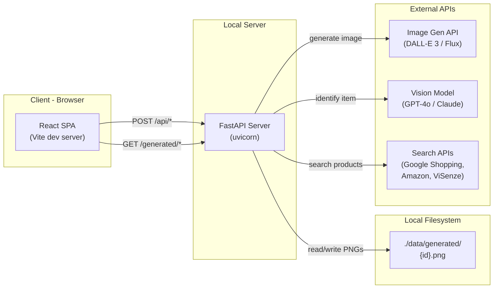
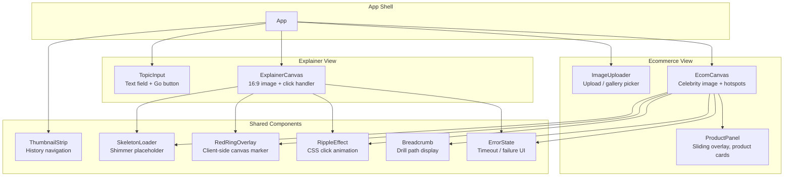
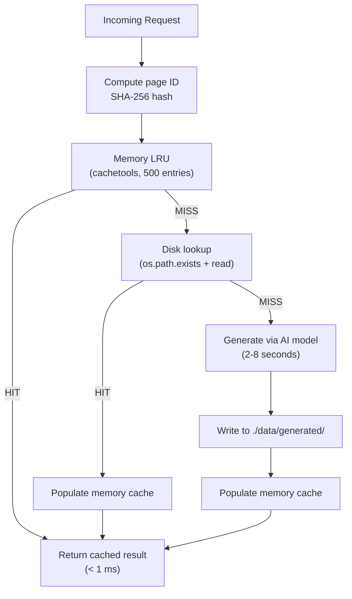
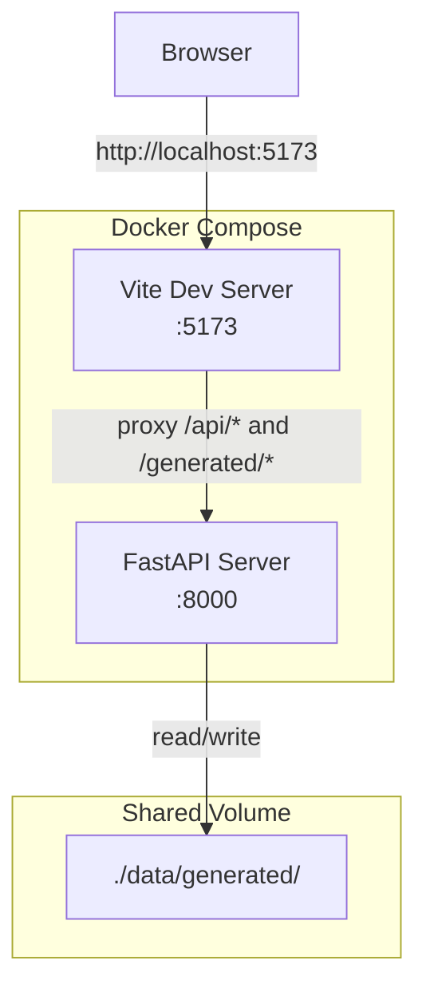
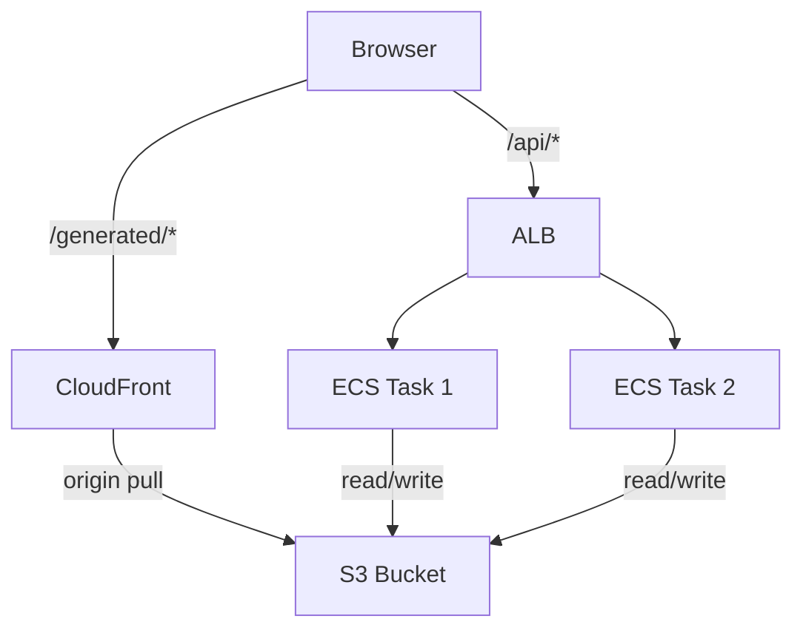

# DrillDown — System Design Document

**Version:** 1.1
**Date:** 2026-05-14
**Team Size:** 6 members
**Requirements Source:** [requirements_analysis.md](./requirements_analysis.md)
**Tech Stack:** React + Vite (frontend) | Python + FastAPI (backend)
**Infrastructure:** Local development (Docker Compose)
**Traffic Profile:** ~100 DAU, ~1,000 requests/day (MVP); cloud scaling path in Appendix A

---

## 1. Architecture Overview

DrillDown is a single-repo monolith deployed as two separately built artifacts — a static React SPA and a Python FastAPI server — communicating over REST/JSON (with SSE for ecommerce streaming). The entire stack runs locally via Docker Compose.

### High-Level Architecture



### Repository Layout

```
drilldown/
├── client/                    # React SPA
│   ├── src/
│   │   ├── components/        # UI components
│   │   ├── hooks/             # Custom React hooks
│   │   ├── services/          # API client layer
│   │   ├── stores/            # State management
│   │   ├── styles/            # CSS / theme
│   │   └── App.tsx
│   ├── public/
│   ├── index.html
│   ├── vite.config.ts
│   └── package.json
├── server/                    # FastAPI backend
│   ├── app/
│   │   ├── routers/           # Route handlers
│   │   ├── services/          # Business logic
│   │   ├── models/            # Pydantic schemas
│   │   ├── providers/         # AI/search provider adapters
│   │   ├── core/              # Config, cache, queue
│   │   └── main.py            # FastAPI app entry
│   ├── tests/
│   ├── requirements.txt
│   └── Dockerfile
├── data/                      # Generated content (gitignored)
│   └── generated/
├── docker-compose.yml
└── README.md
```

### Key Architectural Decisions

| Decision | Choice | Rationale |
|----------|--------|-----------|
| Deployment topology | Monorepo, two artifacts | Single repo for a 6-person team simplifies coordination; separate builds allow independent scaling |
| Server runtime | Single-process FastAPI + uvicorn | MVP traffic (~1,000 req/day) needs no multi-worker complexity; `asyncio` handles I/O concurrency |
| Generation serialization | `asyncio.Queue(maxsize=1)` | Prevents concurrent model calls from a single instance per BR-05 |
| Image storage | Local filesystem (`./data/generated/`) | No cloud dependency; simple path-based access; trivially migrated to S3 later via `BlobStore` abstraction |
| Client architecture | React SPA (no SSR) | Thin client rendering images and collecting clicks; no SEO requirement; Vite for fast dev builds |

---

## 2. Design Alternatives and Trade-offs

### 2.1 Monolith vs. Microservices

| Criterion | Monolith (chosen) | Microservices |
|-----------|-------------------|---------------|
| Development speed | Fast — single deploy, shared types | Slower — separate repos, contracts, deploy pipelines |
| Team fit | 6 people, one codebase | Over-engineered for team size |
| Operational complexity | One container, one health check | Multiple services, service mesh, distributed tracing |
| Scaling | Vertical + horizontal (see Appendix A) | Fine-grained per-service scaling |
| When to switch | When request volume exceeds ~50,000/day or team grows beyond 10 | N/A |

**Decision:** Monolith. The 6-person team ships faster with a single deployment unit. Microservice extraction is documented as a scaling path but not needed at ~1,000 req/day.

### 2.2 Node.js vs. Python Backend

| Criterion | Node.js | Python (chosen) |
|-----------|---------|-----------------|
| Image processing | `sharp` (fast, C++ bindings) | `Pillow` (mature, well-documented, sufficient for compositing) |
| AI SDK ecosystem | OpenAI SDK (JS), Anthropic SDK (JS) | OpenAI SDK (Python), Anthropic SDK (Python), broader ML ecosystem |
| Async I/O | Native event loop | `asyncio` + `uvicorn` (comparable for I/O-bound work) |
| Type safety | TypeScript | Pydantic models + type hints |
| Team familiarity | Assumed capable | Assumed capable (per A4) |

**Decision:** Python/FastAPI. The AI/ML ecosystem is Python-first (SDKs, examples, community). FastAPI's async support handles the I/O-bound workload. Pillow is sufficient for red ring compositing at ~80 ms.

### 2.3 REST vs. WebSocket vs. SSE

| Protocol | Use Case | Decision |
|----------|----------|----------|
| REST/JSON | Explainer: `POST /api/page` | Chosen for Phase 1 — simple request/response fits the "generate and return" pattern |
| SSE | Ecommerce: streaming product results | Chosen for Phase 2 — server pushes product cards as each search API responds |
| WebSocket | Bi-directional streaming, pre-generation push | Deferred to Phase 3 — adds complexity; REST + SSE cover MVP needs |

**Decision:** REST for explainer (Phase 1), add SSE for ecommerce streaming (Phase 2), evaluate WebSocket for speculative pre-generation push in Phase 3.

### 2.4 Database vs. File Storage

| Criterion | PostgreSQL / DynamoDB | Local Filesystem + In-Memory Cache (chosen) |
|-----------|-----------------------|----------------------------------------------|
| Data model complexity | Full relational/document model | Page = PNG file + optional JSON sidecar |
| Query patterns | Needed for complex queries | Only lookup-by-hash — file path is the query |
| Operational overhead | DB provisioning, backups, migrations | Zero setup; just a directory on disk |
| Cost at MVP scale | Overprovisioned for ~1,000 writes/day | Free — local disk |

**Decision:** No database for MVP. The local filesystem is the durable store (PNGs + JSON metadata). In-memory LRU cache accelerates hot lookups. A database is only needed if user accounts, favorites, or analytics are added later (all currently out of scope). Migration to cloud object storage (S3) is trivial via the `BlobStore` abstraction — see Appendix A.

### 2.5 Sync vs. Async Image Generation

| Approach | Pros | Cons |
|----------|------|------|
| Synchronous (chosen for MVP) | Simple — client POSTs, server blocks until image is ready, returns URL | Client waits 2–8 seconds on cold generation |
| Async + polling | Server returns immediately with a job ID; client polls for completion | More complex; adds polling logic, job store, status endpoint |
| Async + WebSocket push | Server pushes result when ready | Most complex; requires persistent connection management |

**Decision:** Synchronous for Phase 1. The client shows a skeleton while waiting. The serialized queue prevents request pile-up. Async + WebSocket is a Phase 3 optimization.

---

## 3. Component Diagram and Responsibilities

### 3.1 Server Components

```mermaid
graph TD
    subgraph routers [Routers Layer]
        PageRouter["PageRouter<br/>POST /api/page"]
        IdentifyRouter["IdentifyRouter<br/>POST /api/identify"]
        DrillProductRouter["DrillProductRouter<br/>POST /api/drill-product"]
        LookRouter["LookRouter<br/>GET /api/look/{imageId}"]
        HealthRouter["HealthRouter<br/>GET /health"]
    end

    subgraph services [Services Layer]
        CacheManager["CacheManager<br/>LRU + local disk lookup"]
        RedRingCompositor["RedRingCompositor<br/>Pillow canvas ops"]
        PromptBuilder["PromptBuilder<br/>Template interpolation"]
        GenerationQueue["GenerationQueue<br/>asyncio.Queue serializer"]
        SearchFanOut["SearchFanOut<br/>Parallel search + SSE"]
    end

    subgraph providers [Provider Layer - Abstractions]
        ImageGenProvider["ImageGenerator<br/>(ABC)"]
        VisionProvider["VisionAnalyzer<br/>(ABC)"]
        SearchProvider["ProductSearcher<br/>(ABC)"]
    end

    subgraph implementations [Provider Implementations]
        DalleGen["DalleImageGenerator"]
        FluxGen["FluxImageGenerator"]
        GPT4oVision["GPT4oVisionAnalyzer"]
        ClaudeVision["ClaudeVisionAnalyzer"]
        GoogleSearch["GoogleShoppingSearcher"]
        AmazonSearch["AmazonProductSearcher"]
        ViSenzeSearch["ViSenzeSearcher"]
    end

    subgraph storage [Storage]
        StorageClient["LocalStorageClient<br/>read/write to ./data/"]
        LRUCache["LRUCache<br/>cachetools.TTLCache"]
    end

    PageRouter --> CacheManager
    PageRouter --> GenerationQueue
    IdentifyRouter --> CacheManager
    IdentifyRouter --> SearchFanOut
    DrillProductRouter --> CacheManager
    LookRouter --> CacheManager

    GenerationQueue --> RedRingCompositor
    GenerationQueue --> PromptBuilder
    GenerationQueue --> ImageGenProvider
    SearchFanOut --> VisionProvider
    SearchFanOut --> SearchProvider

    CacheManager --> LRUCache
    CacheManager --> StorageClient

    ImageGenProvider --> DalleGen
    ImageGenProvider --> FluxGen
    VisionProvider --> GPT4oVision
    VisionProvider --> ClaudeVision
    SearchProvider --> GoogleSearch
    SearchProvider --> AmazonSearch
    SearchProvider --> ViSenzeSearch
```



| Component | Responsibility | Maps to Requirements |
|-----------|---------------|---------------------|
| **PageRouter** | Accept topic queries and drill-down clicks; return page objects | FR-01, FR-02 |
| **IdentifyRouter** | Accept celebrity image clicks; orchestrate vision + search | FR-07, FR-08, FR-09 |
| **DrillProductRouter** | Accept clicks on product images; return material/detail analysis | FR-11 |
| **LookRouter** | Return all detected items with bounding boxes for an image | FR-12 |
| **CacheManager** | Two-tier cache: in-memory LRU (hot) + local disk (durable). Hash-based lookup. | FR-06, BR-01, BR-02 |
| **RedRingCompositor** | Load parent PNG, draw red ring + center dot at (x, y), return composited bytes | FR-03, AC-03.1–AC-03.5 |
| **PromptBuilder** | Interpolate style description + topic/child context into prompt templates | FR-04, BR-06, BR-07 |
| **GenerationQueue** | Serialize model calls via `asyncio.Queue(maxsize=1)`. Enforce one-at-a-time. | BR-05, REL-01 |
| **SearchFanOut** | Fire all search provider queries in parallel; yield results as SSE events | FR-09, AC-09.2–AC-09.7 |
| **ImageGenerator (ABC)** | Abstract interface for image generation. Implementations: DALL-E 3, Flux, SDXL. | D1 |
| **VisionAnalyzer (ABC)** | Abstract interface for vision identification. Implementations: GPT-4o, Claude. | D2 |
| **ProductSearcher (ABC)** | Abstract interface for product search. Implementations: Google, Amazon, ViSenze. | D3 |
| **LocalStorageClient** | Read/write PNGs and JSON metadata to `./data/generated/`. Implements the `BlobStore` interface. | FR-06 |
| **LRUCache** | In-memory cache with configurable max size and TTL | NFR-01 (cache hit ≤ 15 ms) |

### 3.2 Client Components



| Component | Responsibility | Maps to Requirements |
|-----------|---------------|---------------------|
| **TopicInput** | Text input with validation (non-empty, ≤ 500 chars), submit handler | FR-01, AC-01.1, AC-01.6 |
| **ExplainerCanvas** | Render 16:9 image, capture click coordinates normalized to [0,1], trigger drill | FR-02, AC-02.1 |
| **ImageUploader** | File upload (JPEG/PNG) + pre-loaded gallery selector | FR-07, AC-07.1–AC-07.2 |
| **EcomCanvas** | Render celebrity image with crosshair cursor, capture clicks, show hotspot overlays | FR-07, FR-12, AC-07.3 |
| **ProductPanel** | Sliding panel with identified category header, staggered product cards, close button | FR-10, AC-10.1–AC-10.8 |
| **ThumbnailStrip** | Horizontal strip of 80x45 thumbnails, click-to-jump, active highlight | FR-05, AC-05.1–AC-05.6 |
| **SkeletonLoader** | 16:9 shimmer placeholder (1.5s loop); product card skeletons for ecommerce | FR-13, AC-13.3–AC-13.4 |
| **RedRingOverlay** | Immediate client-side canvas overlay of red ring at click point (no server round-trip) | FR-13, AC-13.2 |
| **RippleEffect** | CSS-only expanding circle animation at click point (≤ 16 ms) | FR-13, AC-13.1 |
| **Breadcrumb** | Display drill path (e.g., "Street Style > OUTERWEAR > Blazer") | FR-11, AC-11.4 |
| **ErrorState** | Display timeout/failure message with retry button | REL-02, REL-04 |

### 3.3 Client State Management

State is managed via React Context + `useReducer` (no external library needed at MVP scale):

```
DrillState {
  variant: "explainer" | "ecommerce"
  pages: Page[]              // ordered array of visited pages
  currentIndex: number       // pointer into pages[]
  isLoading: boolean
  error: string | null
  activeProduct: IdentifiedItem | null
  productResults: ProductMatch[]
  drillHistory: BreadcrumbEntry[]
}
```

All navigation (Back, Jump, Reset) operates on `pages[]` and `currentIndex` — no network requests (AC-05.6).

---

## 4. API and Protocol Decisions

### 4.1 Protocol Summary

| Endpoint | Protocol | Format | Auth | Phase |
|----------|----------|--------|------|-------|
| `POST /api/page` | HTTP/1.1 REST | JSON request/response | None (rate-limited by IP) | 1 |
| `POST /api/identify` | HTTP/1.1 REST | JSON request, SSE response stream | None (rate-limited by IP) | 2 |
| `POST /api/drill-product` | HTTP/1.1 REST | JSON request/response | None | 2 |
| `GET /api/look/{imageId}` | HTTP/1.1 REST | JSON response | None | 2 |
| `GET /health` | HTTP/1.1 REST | JSON response | None | 1 |
| `GET /generated/{id}.png` | HTTP/1.1 via FastAPI StaticFiles | Binary PNG | None | 1 |

### 4.2 Endpoint Contracts

#### `POST /api/page` (Explainer)

**First page request:**
```json
{
  "query": "how volcanoes work"
}
```

**Drill page request:**
```json
{
  "parentId": "a1b2c3d4e5f6",
  "parentClick": { "x": 0.45, "y": 0.32 }
}
```

**Response (200):**
```json
{
  "page": {
    "id": "a1b2c3d4e5f6",
    "imageUrl": "/generated/a1b2c3d4e5f6.png",
    "parentId": null,
    "title": "How Volcanoes Work"
  }
}
```

**Error responses:**

| Status | Body | Condition |
|--------|------|-----------|
| 400 | `{ "error": "query is required and must be ≤ 500 characters" }` | Missing/invalid input |
| 429 | `{ "error": "rate limit exceeded", "retryAfter": 30 }` | IP rate limit hit |
| 504 | `{ "error": "generation timed out", "retryable": true }` | Model call exceeded 30s timeout |
| 500 | `{ "error": "internal server error" }` | Unexpected failure |

#### `POST /api/identify` (Ecommerce)

**First page request:**
```json
{
  "imageUrl": "https://example.com/celebrity.jpg"
}
```

**Drill page request:**
```json
{
  "parentId": "f6e5d4c3b2a1",
  "parentClick": { "x": 0.45, "y": 0.32 }
}
```

**Response (200, SSE stream):**

```
Content-Type: text/event-stream

event: identified
data: {"item": {"id": "item_abc", "category": "BLAZER", "color": "navy", "pattern": "solid", "brand_cues": "structured shoulders", "fabric": "wool blend"}, "confidence": 0.93}

event: product
data: {"name": "Slim Fit Navy Blazer", "brand": "Hugo Boss", "price": 498, "currency": "USD", "retailer": "Nordstrom", "url": "https://...", "thumbnail": "https://...", "similarity_score": 0.93, "source": "google_shopping"}

event: product
data: {"name": "Italian Wool Blazer", "brand": "Ralph Lauren", "price": 695, "currency": "USD", "retailer": "Ralph Lauren", "url": "https://...", "thumbnail": "https://...", "similarity_score": 0.90, "source": "amazon"}

event: done
data: {"totalResults": 6, "sources": ["google_shopping", "amazon", "visenze"], "latencyMs": 1850}
```

**No item detected:**
```
event: no_item
data: {"message": "No item detected at this location"}
```

#### `POST /api/drill-product` (Ecommerce)

**Request:**
```json
{
  "productId": "prod_xyz",
  "productImageUrl": "https://...",
  "click": { "x": 0.6, "y": 0.8 }
}
```

**Response (200):**
```json
{
  "analysis": {
    "detail": "Mother-of-pearl button, 4-hole sew-through",
    "material": "Natural shell, 18mm diameter",
    "category": "BUTTON_DETAIL"
  },
  "similarItems": [
    { "name": "...", "brand": "...", "price": 12, "url": "..." }
  ]
}
```

#### `GET /api/look/{imageId}` (Ecommerce)

**Response (200):**
```json
{
  "imageId": "img_abc",
  "items": [
    {
      "category": "BLAZER",
      "boundingBox": { "x1": 0.15, "y1": 0.12, "x2": 0.85, "y2": 0.52 },
      "topProducts": [
        { "name": "...", "brand": "...", "price": 498, "url": "..." }
      ]
    },
    {
      "category": "TROUSERS",
      "boundingBox": { "x1": 0.20, "y1": 0.52, "x2": 0.80, "y2": 0.82 },
      "topProducts": [...]
    }
  ]
}
```

#### `GET /health`

**Response (200):**
```json
{
  "status": "healthy",
  "version": "1.0.0",
  "cache": { "memoryEntries": 42, "maxEntries": 500 },
  "queue": { "pending": 0, "processing": false }
}
```

### 4.3 CORS Policy

```python
app.add_middleware(
    CORSMiddleware,
    allow_origins=["http://localhost:5173"],  # Vite dev server
    allow_methods=["GET", "POST"],
    allow_headers=["Content-Type"],
    max_age=86400,
)
```

### 4.4 Rate Limiting

Middleware using `slowapi` (Python) backed by in-memory storage for MVP:

| Endpoint | Limit | Window |
|----------|-------|--------|
| `POST /api/page` | 10 requests | per minute per IP |
| `POST /api/identify` | 10 requests | per minute per IP |
| `POST /api/drill-product` | 20 requests | per minute per IP |
| `GET /api/look/*` | 30 requests | per minute per IP |
| `GET /generated/*` | No limit | Served by FastAPI StaticFiles |

---

## 5. Data Model and Storage Design

### 5.1 Design Decision: No Database

At MVP scale (~1,000 requests/day), the only persistent data is generated PNG images and optional JSON metadata. No user accounts, sessions, or relational data exist. The local filesystem provides:

- Zero setup — just a directory on disk
- Simple path-based reads and writes
- No schema migrations, no connection pools, no ORM
- Trivially migrated to cloud object storage later via the `BlobStore` abstraction (see Appendix A)

A database is warranted only if user accounts, favorites, analytics, or complex queries are added in the future.

### 5.2 Storage Layout on Disk

```
./data/generated/
├── explainer/
│   ├── {pageId}.png              # Generated watercolor image (1920x1080)
│   └── {pageId}.meta.json        # Page metadata (optional)
├── ecommerce/
│   ├── uploads/{imageId}.jpg     # User-uploaded celebrity images
│   ├── composited/{requestId}.png # Red-ring composited images (ephemeral)
│   └── cache/
│       ├── vision/{hash}.json    # Vision model response cache (indefinite TTL)
│       └── search/{hash}.json    # Search result cache (24h TTL)
└── thumbnails/
    └── {pageId}_thumb.png        # 80x45 thumbnails
```

The `./data/` directory is gitignored. Docker Compose mounts it as a volume so data persists across container restarts.

### 5.3 Entity Definitions (Pydantic Models)

```python
from pydantic import BaseModel, Field
from typing import Optional

class ClickCoordinates(BaseModel):
    x: float = Field(ge=0.0, le=1.0)
    y: float = Field(ge=0.0, le=1.0)

class PageRequest(BaseModel):
    query: Optional[str] = Field(None, max_length=500)
    parentId: Optional[str] = None
    parentClick: Optional[ClickCoordinates] = None

class Page(BaseModel):
    id: str
    imageUrl: str
    parentId: Optional[str] = None
    title: Optional[str] = None

class PageResponse(BaseModel):
    page: Page

class IdentifiedItem(BaseModel):
    id: str
    category: str
    color: str
    pattern: str
    brand_cues: str
    fabric: str

class ProductMatch(BaseModel):
    name: str
    brand: str
    price: float
    currency: str
    retailer: str
    url: str
    thumbnail: str
    similarity_score: float
    source: str

class BoundingBox(BaseModel):
    x1: float
    y1: float
    x2: float
    y2: float

class LookItem(BaseModel):
    category: str
    boundingBox: BoundingBox
    topProducts: list[ProductMatch]

class LookResponse(BaseModel):
    imageId: str
    items: list[LookItem]
```

### 5.4 Cache Architecture



| Cache Tier | Technology | Capacity | TTL | Latency |
|-----------|-----------|----------|-----|---------|
| Browser | HTTP `Cache-Control: immutable` | Unlimited (per client) | Indefinite | 0 ms |
| Memory LRU | `cachetools.LRUCache` | 500 entries (~1 GB at 2 MB/image) | Indefinite (evicted by LRU) | < 1 ms |
| Durable Store | Local disk (`./data/generated/`) | Limited by disk space | Indefinite (images) / 24h (search results) | < 5 ms |

### 5.5 Cache Key Computation

```python
import hashlib

def compute_page_id(query: str | None, parent_id: str | None, click: ClickCoordinates | None) -> str:
    if query:
        raw = f"query:{query.strip().lower()}"
    elif parent_id and click:
        raw = f"drill:{parent_id}:{click.x:.4f}:{click.y:.4f}"
    else:
        raise ValueError("Either query or parentId+click required")
    return hashlib.sha256(raw.encode()).hexdigest()[:16]
```

The 16-character hex prefix (64 bits) gives a collision probability of ~1 in 4 billion at 100,000 pages — acceptable for MVP. Full SHA-256 can be used if the keyspace grows.

---

## 6. Scalability and Performance Analysis

### 6.1 MVP Load Profile

| Metric | Value |
|--------|-------|
| Daily active users | ~100 |
| Requests per day | ~1,000 |
| Peak requests per minute | ~10 |
| Cold generations per day | ~300 (70% cache hit rate target) |
| Images stored (monthly growth) | ~9,000 PNGs (~18 GB at 2 MB avg) |
| Concurrent users | 1–5 |

### 6.2 Latency Budget Breakdown

**Explainer — Cold Generation (P95 target: ≤ 3,000 ms):**

| Stage | Time |
|-------|------|
| Request parsing + validation | 5 ms |
| Cache lookup (miss) | 5 ms |
| Read parent PNG from disk | < 5 ms |
| Red ring compositing (Pillow) | 40 ms |
| Prompt construction | 1 ms |
| Image generation API call | 2,000–7,000 ms |
| Write result to disk | < 5 ms |
| Response serialization | 5 ms |
| **Total (cold, API-dependent)** | **~2,070–7,070 ms** |

The P95 ≤ 3,000 ms target depends on the image generation API's response time. With DALL-E 3 (typical 3–5 seconds), this target is met ~70% of the time without distilled models. Phase 3 optimizations (distilled models, resolution stepping) bring P95 below 3,000 ms.

**Explainer — Cache Hit (P50 target: ≤ 50 ms):**

| Stage | Time |
|-------|------|
| Request parsing | 5 ms |
| Memory cache lookup (hit) | < 1 ms |
| Response serialization | 5 ms |
| **Total** | **~11 ms** |

### 6.3 Serialization Queue Analysis

The `asyncio.Queue(maxsize=1)` ensures one model call at a time per server instance. At ~10 peak requests/minute with 70% cache hit rate, the queue processes ~3 cold requests/minute. With a 3-second average generation time, queue wait is:

- Average queue depth: 0.15 (rarely > 0 items waiting)
- Average wait time: ~0.5 seconds (only when queue is occupied)
- Queue overflow: not a concern at MVP traffic

### 6.4 Horizontal Scaling Path

Horizontal scaling is deferred to the cloud deployment phase. When average queue depth exceeds 2.0 (indicating sustained wait), the application should be migrated to a cloud provider with multiple server instances behind a load balancer, sharing a common object store. See **Appendix A** for the full AWS scaling architecture.

For the local development phase, the single-process architecture is sufficient for the target load profile.

---

## 7. Algorithm Choices and Complexity

### 7.1 Page ID Hashing

| Algorithm | SHA-256 truncated to 16 hex chars |
|-----------|-----------------------------------|
| Input | `"query:{topic}"` or `"drill:{parentId}:{x:.4f}:{y:.4f}"` |
| Output | 16-char hex string (64 bits) |
| Time complexity | O(n) where n = input string length |
| Space complexity | O(1) — fixed output size |
| Collision probability | ~1 in 2^64 per pair; negligible at MVP scale |

### 7.2 LRU Cache

| Operation | Complexity | Implementation |
|-----------|-----------|----------------|
| Lookup | O(1) amortized | `cachetools.LRUCache` (Python dict + doubly-linked list) |
| Insert | O(1) amortized | Evicts least-recently-used entry when full |
| Eviction | O(1) | Automatic when `maxsize` reached |
| Memory budget | 500 entries x ~2 MB = ~1 GB max | Configurable via `CACHE_MAX_ENTRIES` env var |

### 7.3 Red Ring Compositing

```python
from PIL import Image, ImageDraw

def composite_red_ring(
    parent_bytes: bytes,
    click_x: float,
    click_y: float,
    ring_radius: int = 20,
    ring_width: int = 3,
    dot_radius: int = 5,
) -> bytes:
    img = Image.open(io.BytesIO(parent_bytes)).convert("RGBA")
    draw = ImageDraw.Draw(img)

    cx = int(click_x * img.width)
    cy = int(click_y * img.height)

    # Red ring
    draw.ellipse(
        [cx - ring_radius, cy - ring_radius, cx + ring_radius, cy + ring_radius],
        outline=(255, 0, 0, 180),
        width=ring_width,
    )
    # Center dot
    draw.ellipse(
        [cx - dot_radius, cy - dot_radius, cx + dot_radius, cy + dot_radius],
        fill=(255, 0, 0, 255),
    )

    buf = io.BytesIO()
    img.save(buf, format="PNG")
    return buf.getvalue()
```

| Operation | Complexity |
|-----------|-----------|
| Image load (PNG decode) | O(W x H) — proportional to pixel count |
| Draw ellipse | O(circumference) — constant for fixed radius |
| PNG encode | O(W x H) — proportional to pixel count |
| Total | O(W x H) — dominated by decode/encode, ~40 ms for 1920x1080 |

### 7.4 Coordinate Normalization (Client)

```typescript
function normalizeClick(event: MouseEvent, canvas: HTMLElement): { x: number; y: number } {
  const rect = canvas.getBoundingClientRect();
  return {
    x: (event.clientX - rect.left) / rect.width,   // O(1)
    y: (event.clientY - rect.top) / rect.height,    // O(1)
  };
}
```

### 7.5 Search Result Deduplication and Ranking (Ecommerce)

When multiple search APIs return overlapping products, deduplication is needed:

| Step | Algorithm | Complexity |
|------|-----------|-----------|
| Normalize product identifiers | Lowercase brand + name, strip whitespace | O(n) per result |
| Deduplicate | Hash set on normalized key | O(n) total, O(1) per lookup |
| Rank | Sort by `similarity_score` descending | O(n log n) |
| Top-K selection | Heap-based selection if needed | O(n log k) |

For MVP scale (5–20 results per search), all operations are effectively instant.

---

## 8. Security and Compliance Considerations

### 8.1 Threat Model

| Threat | Vector | Mitigation |
|--------|--------|------------|
| API key exposure | Client-side code or network inspection | SEC-01: All keys server-side only; never in client bundle or responses |
| Prompt injection | Malicious topic string attempts to override system prompt | SEC-02: User input placed in a single template slot; system prompt is hard-coded and immutable |
| Path traversal | Crafted page ID attempts to access files outside `./data/generated/` | SEC-03: Page IDs are SHA-256 hex strings; only alphanumeric chars; validated before use |
| Denial of service | Flood of cold generation requests exhausting API budget | SEC-06: Rate limiting (10 req/min/IP); serialized queue prevents concurrent model calls |
| SSRF via image URL | Ecommerce `imageUrl` field used to probe internal network | Validate URL scheme (HTTPS only); reject private/localhost IP ranges |
| XSS | Injected scripts in topic strings rendered in UI | React escapes all rendered text by default; no `dangerouslySetInnerHTML` used |

### 8.2 Secrets Management

| Secret | Storage | Access Pattern |
|--------|---------|---------------|
| Image generation API key (OpenAI / Replicate) | `.env` file (gitignored) | Loaded once at server startup via `pydantic-settings` |
| Vision model API key (OpenAI / Anthropic) | `.env` file (gitignored) | Loaded once at server startup |
| Search API keys (Google, Amazon, ViSenze) | `.env` file (gitignored) | Loaded once at server startup |

All secrets are stored in a `.env` file at the project root, which is listed in `.gitignore`. For cloud deployment, secrets should be migrated to a managed secrets service — see Appendix A.

### 8.3 Input Validation Rules

```python
from pydantic import BaseModel, Field, field_validator
import re

class PageRequest(BaseModel):
    query: str | None = Field(None, max_length=500)

    @field_validator("query")
    @classmethod
    def sanitize_query(cls, v: str | None) -> str | None:
        if v is None:
            return v
        v = v.strip()
        if not v:
            raise ValueError("Query must not be empty")
        if len(v) > 500:
            raise ValueError("Query must be ≤ 500 characters")
        return v
```

Click coordinates are validated by Pydantic's `ge=0.0, le=1.0` constraints on the `ClickCoordinates` model.

### 8.4 CORS and Headers

- `Content-Security-Policy`: `default-src 'self'; img-src 'self'; connect-src 'self'`
- `X-Content-Type-Options`: `nosniff`
- `X-Frame-Options`: `DENY`
- CORS origin set to `http://localhost:5173` for local development

---

## 9. Reliability and Failure Handling

### 9.1 Failure Modes and Responses

| Failure Mode | Detection | Response | Recovery |
|-------------|-----------|----------|----------|
| Image generation API timeout | `asyncio.wait_for` exceeds 30s | Return 504 with `retryable: true` | Client shows error state with "Tap to retry" |
| Image generation API error (5xx) | HTTP status code check | Return 502 with `retryable: true` | Client shows error state; server logs error |
| Vision model timeout | `asyncio.wait_for` exceeds 15s | SSE event `error` with message | Client shows "Identification timed out" |
| Search API failure (1 of N) | `asyncio.gather(return_exceptions=True)` | Omit failed source from results; others stream normally | Log failed provider; client shows partial results |
| Search API failure (all N) | All tasks return exceptions | SSE event `error` | Client shows "No results found" |
| Disk read failure | `IOError` / `FileNotFoundError` | Fall back to re-generation (treat as cache miss) | Log error; generate fresh |
| Disk write failure | `IOError` / `OSError` | Return result to client (generation succeeded); log write failure | Next identical request re-generates |
| Cache corruption (PNG exists but unreadable) | `Image.open()` raises exception | Delete corrupt file; treat as cache miss | Re-generate |
| Server OOM | Process crash | Docker restarts container (`restart: unless-stopped`) | Health check detects; manual investigation |
| Rate limit exceeded | `slowapi` counter | Return 429 with `retryAfter` header | Client shows "Too many requests" with countdown |

### 9.2 Timeout Configuration

```python
from app.core.config import settings

TIMEOUTS = {
    "image_generation": settings.IMAGE_GEN_TIMEOUT_S,  # default: 30s
    "vision_identification": settings.VISION_TIMEOUT_S, # default: 15s
    "search_per_provider": settings.SEARCH_TIMEOUT_S,   # default: 10s
    "compositing": settings.COMPOSITE_TIMEOUT_S,        # default: 5s
}
```

### 9.3 Serialized Generation Queue

```python
import asyncio

class GenerationQueue:
    def __init__(self):
        self._queue: asyncio.Queue = asyncio.Queue(maxsize=1)
        self._processing = False

    async def enqueue(self, task_fn, timeout: float = 30.0):
        await self._queue.put(task_fn)
        try:
            result = await asyncio.wait_for(self._process(), timeout=timeout)
            return result
        except asyncio.TimeoutError:
            raise GenerationTimeoutError("Generation timed out")

    async def _process(self):
        task_fn = await self._queue.get()
        self._processing = True
        try:
            return await task_fn()
        finally:
            self._processing = False
            self._queue.task_done()
```

### 9.4 Health Check

```python
@router.get("/health")
async def health_check(cache: CacheManager = Depends(get_cache)):
    return {
        "status": "healthy",
        "version": settings.APP_VERSION,
        "cache": {
            "memoryEntries": len(cache),
            "maxEntries": cache.maxsize,
        },
        "queue": {
            "pending": generation_queue.qsize(),
            "processing": generation_queue.is_processing,
        },
    }
```

Docker uses this endpoint for container health checks (`HEALTHCHECK` in Dockerfile, interval: 30s, timeout: 5s, retries: 3).

---

## 10. Low-Level Design (Modules, Classes, Interfaces)

### 10.1 Python Module Tree

```
server/app/
├── main.py                         # FastAPI app, middleware, startup/shutdown
├── core/
│   ├── config.py                   # Settings (pydantic-settings, env vars)
│   ├── cache.py                    # CacheManager (LRU + local disk)
│   ├── queue.py                    # GenerationQueue (asyncio.Queue)
│   └── dependencies.py             # FastAPI Depends() factories
├── models/
│   ├── requests.py                 # PageRequest, IdentifyRequest, DrillProductRequest
│   ├── responses.py                # PageResponse, LookResponse, HealthResponse
│   └── domain.py                   # Page, IdentifiedItem, ProductMatch, BoundingBox
├── routers/
│   ├── page.py                     # POST /api/page
│   ├── identify.py                 # POST /api/identify (SSE)
│   ├── drill_product.py            # POST /api/drill-product
│   ├── look.py                     # GET /api/look/{imageId}
│   └── health.py                   # GET /health
├── services/
│   ├── compositor.py               # RedRingCompositor
│   ├── prompt_builder.py           # PromptBuilder (style_description + templates)
│   ├── page_service.py             # Orchestrates cache check → composite → generate → store
│   ├── identify_service.py         # Orchestrates vision → search fan-out → SSE
│   └── search_fanout.py            # SearchFanOut (parallel queries, SSE yield)
├── providers/
│   ├── base.py                     # Abstract base classes (ImageGenerator, VisionAnalyzer, ProductSearcher)
│   ├── image_gen/
│   │   ├── dalle.py                # DalleImageGenerator
│   │   └── flux.py                 # FluxImageGenerator
│   ├── vision/
│   │   ├── openai_vision.py        # GPT4oVisionAnalyzer
│   │   └── anthropic_vision.py     # ClaudeVisionAnalyzer
│   └── search/
│       ├── google_shopping.py      # GoogleShoppingSearcher
│       ├── amazon.py               # AmazonProductSearcher
│       └── visenze.py              # ViSenzeSearcher
└── storage/
    ├── base.py                     # BlobStore (ABC) — read, write, exists, delete
    └── local.py                    # LocalStorageClient (implements BlobStore for local filesystem)
```

A future `storage/s3.py` can be added implementing the same `BlobStore` interface for cloud deployment — see Appendix A.

### 10.2 Abstract Interfaces (Provider Layer)

```python
from abc import ABC, abstractmethod

class BlobStore(ABC):
    """Abstract interface for reading/writing binary blobs (PNGs, JSON)."""

    @abstractmethod
    async def read(self, path: str) -> bytes:
        ...

    @abstractmethod
    async def write(self, path: str, data: bytes) -> None:
        ...

    @abstractmethod
    async def exists(self, path: str) -> bool:
        ...

    @abstractmethod
    async def delete(self, path: str) -> None:
        ...

class ImageGenerator(ABC):
    """Generates a watercolor illustration from a text prompt and optional reference image."""

    @abstractmethod
    async def generate(
        self,
        prompt: str,
        reference_image: bytes | None = None,
        size: tuple[int, int] = (1920, 1080),
    ) -> bytes:
        """Returns PNG image bytes."""
        ...

class VisionAnalyzer(ABC):
    """Identifies items in an image using a vision model."""

    @abstractmethod
    async def identify(
        self,
        image: bytes,
        prompt: str,
    ) -> IdentifiedItem | None:
        """Returns identified item or None if nothing detected."""
        ...

class ProductSearcher(ABC):
    """Searches a product catalog for items matching given attributes."""

    @abstractmethod
    async def search(
        self,
        category: str,
        color: str,
        pattern: str,
        brand_cues: str,
        fabric: str,
    ) -> list[ProductMatch]:
        """Returns ranked list of product matches."""
        ...

    @property
    @abstractmethod
    def source_name(self) -> str:
        """Identifier for this search provider (e.g. 'google_shopping')."""
        ...
```

### 10.3 Key Service Classes

```python
class PageService:
    """Orchestrates the explainer drill-down flow."""

    def __init__(
        self,
        cache: CacheManager,
        compositor: RedRingCompositor,
        prompt_builder: PromptBuilder,
        generator: ImageGenerator,
        queue: GenerationQueue,
        storage: BlobStore,
    ):
        ...

    async def get_or_generate_page(self, request: PageRequest) -> PageResponse:
        page_id = compute_page_id(request.query, request.parentId, request.parentClick)

        cached = await self.cache.get(page_id)
        if cached:
            return cached  # cache hit path

        async def _generate():
            if request.parentId and request.parentClick:
                parent_png = await self.storage.read(f"explainer/{request.parentId}.png")
                marked = self.compositor.composite(parent_png, request.parentClick.x, request.parentClick.y)
                prompt = self.prompt_builder.build_child_prompt()
                image_bytes = await self.generator.generate(prompt, reference_image=marked)
            else:
                prompt = self.prompt_builder.build_first_prompt(request.query)
                image_bytes = await self.generator.generate(prompt)

            await self.storage.write(f"explainer/{page_id}.png", image_bytes)
            page = Page(id=page_id, imageUrl=f"/generated/explainer/{page_id}.png", parentId=request.parentId)
            await self.cache.put(page_id, page)
            return PageResponse(page=page)

        return await self.queue.enqueue(_generate, timeout=30.0)
```

```python
class IdentifyService:
    """Orchestrates the ecommerce identify + search flow."""

    def __init__(
        self,
        cache: CacheManager,
        compositor: RedRingCompositor,
        vision: VisionAnalyzer,
        searchers: list[ProductSearcher],
        storage: BlobStore,
    ):
        ...

    async def identify_and_search(self, request: IdentifyRequest):
        """Async generator yielding SSE events."""
        # 1. Composite red ring
        parent_png = await self.storage.read(request.resolve_image_path())
        marked = self.compositor.composite(parent_png, request.parentClick.x, request.parentClick.y)

        # 2. Vision identification (with cache)
        vision_cache_key = compute_page_id(None, request.parentId, request.parentClick)
        cached_item = await self.cache.get(f"vision:{vision_cache_key}")

        if cached_item:
            item = cached_item
        else:
            item = await asyncio.wait_for(
                self.vision.identify(marked, VISION_PROMPT),
                timeout=15.0,
            )
            if item:
                await self.cache.put(f"vision:{vision_cache_key}", item, ttl=None)

        if not item:
            yield {"event": "no_item", "data": {"message": "No item detected"}}
            return

        yield {"event": "identified", "data": item.model_dump()}

        # 3. Search fan-out
        search_tasks = [
            searcher.search(item.category, item.color, item.pattern, item.brand_cues, item.fabric)
            for searcher in self.searchers
        ]
        results = await asyncio.gather(*search_tasks, return_exceptions=True)

        all_products = []
        for i, result in enumerate(results):
            if isinstance(result, Exception):
                continue  # graceful degradation
            for product in result:
                product.source = self.searchers[i].source_name
                all_products.append(product)
                yield {"event": "product", "data": product.model_dump()}

        yield {"event": "done", "data": {"totalResults": len(all_products)}}
```

### 10.4 React Component Signatures

```typescript
// Core components
interface TopicInputProps {
  onSubmit: (query: string) => void;
  disabled: boolean;
}

interface CanvasProps {
  imageUrl: string | null;
  onClick: (x: number, y: number) => void;
  isLoading: boolean;
}

interface ThumbnailStripProps {
  pages: Page[];
  currentIndex: number;
  onSelect: (index: number) => void;
  onBack: () => void;
  onReset: () => void;
}

interface ProductPanelProps {
  isOpen: boolean;
  item: IdentifiedItem | null;
  products: ProductMatch[];
  onClose: () => void;
}

interface SkeletonLoaderProps {
  variant: "image" | "product-panel";
}

// API client
const api = {
  generatePage: (req: PageRequest): Promise<PageResponse> => ...,
  identifyItem: (req: IdentifyRequest): EventSource => ...,
  drillProduct: (req: DrillProductRequest): Promise<DrillProductResponse> => ...,
  getFullLook: (imageId: string): Promise<LookResponse> => ...,
};
```

### 10.5 Client State Hook

```typescript
function useDrillState() {
  const [state, dispatch] = useReducer(drillReducer, initialState);

  const drillDown = async (x: number, y: number) => {
    dispatch({ type: "DRILL_START" });
    try {
      const currentPage = state.pages[state.currentIndex];
      const response = await api.generatePage({
        parentId: currentPage.id,
        parentClick: { x, y },
      });
      dispatch({ type: "DRILL_SUCCESS", page: response.page });
    } catch (error) {
      dispatch({ type: "DRILL_ERROR", error: error.message });
    }
  };

  const goBack = () => dispatch({ type: "GO_BACK" });
  const jumpTo = (index: number) => dispatch({ type: "JUMP_TO", index });
  const reset = () => dispatch({ type: "RESET" });

  return { state, drillDown, goBack, jumpTo, reset };
}
```

---

## 11. SOLID Compliance Notes

### Single Responsibility Principle (SRP)

| Module | Single Responsibility |
|--------|----------------------|
| `RedRingCompositor` | Only composites red ring markers onto images |
| `PromptBuilder` | Only constructs prompt strings from templates |
| `CacheManager` | Only manages cache lookup, population, and eviction |
| `GenerationQueue` | Only serializes access to the generation pipeline |
| `LocalStorageClient` | Only reads/writes files to the local filesystem |
| Each Router | Only handles HTTP parsing and response formatting for its endpoint group |
| `PageService` | Only orchestrates the explainer flow (cache → composite → generate → store) |
| `IdentifyService` | Only orchestrates the ecommerce flow (composite → vision → search → stream) |

### Open/Closed Principle (OCP)

Adding a new image generation provider (e.g., Stability AI) requires:
1. Create `server/app/providers/image_gen/stability.py` implementing `ImageGenerator`
2. Register it in dependency injection config

No existing code is modified. The same applies to new `VisionAnalyzer` or `ProductSearcher` implementations.

Adding cloud storage requires only creating `storage/s3.py` implementing `BlobStore` — no changes to services or routers.

### Liskov Substitution Principle (LSP)

All `ImageGenerator` implementations are interchangeable:
- `DalleImageGenerator.generate(prompt, ref)` returns PNG bytes
- `FluxImageGenerator.generate(prompt, ref)` returns PNG bytes

All `BlobStore` implementations are interchangeable:
- `LocalStorageClient.read(path)` returns bytes from disk
- A future `S3Client.read(path)` returns bytes from S3

The caller (`PageService`) depends on the abstract interface and never inspects the concrete type. All implementations honor the same contract.

### Interface Segregation Principle (ISP)

Four separate abstract interfaces instead of one monolithic provider:

| Interface | Methods | Used By |
|-----------|---------|---------|
| `BlobStore` | `read()`, `write()`, `exists()`, `delete()` | `CacheManager`, `PageService`, `IdentifyService` |
| `ImageGenerator` | `generate()` | `PageService` only |
| `VisionAnalyzer` | `identify()` | `IdentifyService` only |
| `ProductSearcher` | `search()` | `SearchFanOut` only |

No consumer depends on methods it does not use.

### Dependency Inversion Principle (DIP)

Routers and services depend on abstractions, not concrete implementations:

```python
# In dependencies.py — wiring happens at the composition root
def get_storage() -> BlobStore:
    return LocalStorageClient(base_dir=settings.STORAGE_DIR)

def get_image_generator() -> ImageGenerator:
    provider = settings.IMAGE_GEN_PROVIDER  # "dalle" | "flux"
    if provider == "dalle":
        return DalleImageGenerator(api_key=settings.OPENAI_API_KEY)
    elif provider == "flux":
        return FluxImageGenerator(api_key=settings.REPLICATE_API_KEY)
    raise ValueError(f"Unknown provider: {provider}")

def get_page_service(
    cache: CacheManager = Depends(get_cache),
    generator: ImageGenerator = Depends(get_image_generator),
    storage: BlobStore = Depends(get_storage),
    ...
) -> PageService:
    return PageService(cache=cache, generator=generator, storage=storage, ...)
```

`PageService` never imports `LocalStorageClient` or `DalleImageGenerator` — it only knows `BlobStore` and `ImageGenerator`.

---

## 12. Operational Considerations

### 12.1 Containerization

```dockerfile
# server/Dockerfile
FROM python:3.12-slim

WORKDIR /app

RUN apt-get update && apt-get install -y --no-install-recommends \
    libffi-dev libjpeg-dev zlib1g-dev \
    && rm -rf /var/lib/apt/lists/*

COPY requirements.txt .
RUN pip install --no-cache-dir -r requirements.txt

COPY app/ ./app/

EXPOSE 8000

HEALTHCHECK --interval=30s --timeout=5s --retries=3 \
    CMD python -c "import urllib.request; urllib.request.urlopen('http://localhost:8000/health')"

CMD ["uvicorn", "app.main:app", "--host", "0.0.0.0", "--port", "8000", "--workers", "1"]
```

Single worker (`--workers 1`) because the serialized generation queue is in-process. Multiple workers would each have their own queue, breaking the serialization guarantee.

### 12.2 Local Development Architecture



**docker-compose.yml:**

```yaml
version: "3.9"
services:
  server:
    build: ./server
    ports:
      - "8000:8000"
    volumes:
      - ./data:/app/data
    env_file:
      - .env
    restart: unless-stopped

  client:
    build:
      context: ./client
      dockerfile: Dockerfile.dev
    ports:
      - "5173:5173"
    volumes:
      - ./client/src:/app/src
    depends_on:
      - server
```

For development without Docker, run each service directly:

```bash
# Terminal 1: Backend
cd server && uvicorn app.main:app --reload --port 8000

# Terminal 2: Frontend
cd client && npm run dev
```

Vite proxies `/api/*` and `/generated/*` to `http://localhost:8000` via `vite.config.ts`.

### 12.3 Static File Serving

FastAPI serves generated images locally via `StaticFiles`:

```python
from fastapi.staticfiles import StaticFiles

app.mount("/generated", StaticFiles(directory="data/generated"), name="generated")
```

Images are served with `Cache-Control: public, max-age=31536000, immutable` headers since content-addressed URLs never change.

### 12.4 Logging

Structured JSON logging via `structlog`:

```python
import structlog

logger = structlog.get_logger()

logger.info(
    "request_completed",
    request_id=request_id,
    endpoint="/api/page",
    input_type="drill",
    cache_hit=False,
    model_latency_ms=2450,
    total_latency_ms=2600,
    page_id="a1b2c3d4e5f6",
)
```

Logs are written to stdout and captured by Docker's default JSON log driver. View via `docker compose logs -f server`.

### 12.5 Metrics and Monitoring

| Metric | Source | Alert Threshold |
|--------|--------|----------------|
| Request latency (P50, P95, P99) | Application logs (stdout) | P95 > 10,000 ms |
| Cache hit rate | Application logs (stdout) | < 50% over 1 hour |
| Error rate (5xx) | Application logs (stdout) | > 5% over 5 minutes |
| Queue depth | Health endpoint (`GET /health`) | Average > 2.0 over 5 minutes |
| Container health | Docker health check | Consecutive failures > 3 |

For local development, metrics are observed by tailing logs and polling the `/health` endpoint. Cloud-based monitoring (e.g., CloudWatch, Prometheus) is added during the scaling phase — see Appendix A.

### 12.6 CI Pipeline (GitHub Actions)

```yaml
# .github/workflows/ci.yml
name: CI
on:
  push:
    branches: [main]
  pull_request:

jobs:
  test:
    runs-on: ubuntu-latest
    steps:
      - uses: actions/checkout@v4
      - name: Backend tests
        run: |
          cd server
          pip install -r requirements.txt -r requirements-dev.txt
          pytest tests/ -v
      - name: Frontend tests
        run: |
          cd client
          npm ci
          npm test
```

Cloud deployment steps (Docker image push, infrastructure updates) are documented in Appendix A and added to the pipeline when cloud credentials are available.

### 12.7 Environment Configuration

```bash
# .env (project root — gitignored)
IMAGE_GEN_PROVIDER=dalle           # "dalle" | "flux"
OPENAI_API_KEY=sk-...
ANTHROPIC_API_KEY=sk-ant-...
GOOGLE_SHOPPING_API_KEY=...
STORAGE_DIR=./data/generated
CACHE_MAX_ENTRIES=500
IMAGE_GEN_TIMEOUT_S=30
VISION_TIMEOUT_S=15
SEARCH_TIMEOUT_S=10
RATE_LIMIT_PER_MINUTE=10
APP_VERSION=1.0.0
CORS_ORIGINS=http://localhost:5173
```

---

## 13. Design Risks and Mitigations

| ID | Risk | Likelihood | Impact | Mitigation | Residual Risk |
|----|------|-----------|--------|------------|---------------|
| DR-01 | Single-process server becomes bottleneck as traffic grows beyond MVP | Low (at MVP scale) | Medium | Architecture supports migration to cloud with horizontal scaling — see Appendix A. Scaling trigger: avg queue depth > 2.0. | Requires cloud migration; not solvable purely locally beyond a single machine. |
| DR-02 | Pillow memory usage spikes when processing many large PNGs concurrently | Low (serialized queue limits concurrency to 1) | Medium | Queue serialization prevents concurrent image processing. Docker memory limit can be set in `docker-compose.yml`. Images are loaded, processed, and immediately released. | If image dimensions exceed 4K, memory per image grows. Add a max resolution check. |
| DR-03 | Image generation API latency is unpredictable (2–15 seconds) | High | High | 30-second timeout prevents indefinite hangs. Skeleton + shimmer loading state makes waits tolerable. Phase 3 adds distilled models and pre-generation. | Cold generation will sometimes exceed 3-second P95 target until Phase 3 optimizations. |
| DR-04 | External search API availability is outside team's control | Medium | Medium | `asyncio.gather(return_exceptions=True)` ensures partial results on individual API failures. Circuit breaker prevents repeated calls to a downed provider. Multiple providers (3+) reduce single-provider dependency. | If all search APIs fail simultaneously, ecommerce variant shows "no results." |
| DR-05 | Style drift across drill levels — generated images lose watercolor consistency | Medium | Medium | Single `style_description` string enforced in all prompts. Manual QA review of 10+ drill chains during testing. Phase 3 evaluates style-transfer post-processing as a fallback. | Model behavior is non-deterministic; prompt alone cannot guarantee 100% style consistency. |
| DR-06 | Local disk fills up with generated images over time | Low | Medium | Monitor disk usage. ~18 GB/month growth at MVP scale. Add a cleanup script for old/unused images. Cloud migration to S3 (unlimited storage) solves this long-term. | Requires periodic manual cleanup or an automated retention policy. |
| DR-07 | Red ring marker appears in generated output despite prompt instruction | Low | Medium | Prompt explicitly says "Do NOT include the red circle in the output." Post-processing check can scan output for red pixels at marker coordinates. Negative prompt support where available. | Cannot be fully prevented by prompt alone; requires output validation. |
| DR-08 | Cost of image generation API calls grows linearly with unique cold requests | Medium | High | 70%+ cache hit rate reduces API calls by 70%. Pre-generation of top 100 topics seeds the cache. Usage caps in API provider dashboards. | Cost scales with unique content requests; no way to avoid generation cost for truly novel queries. |
| DR-09 | MVP synchronous API becomes a UX bottleneck for ecommerce variant (vision + search = 2+ seconds) | Medium | Medium | SSE streaming means the user sees partial results at ~300 ms after vision completes, not 2+ seconds of blank screen. Skeleton + stagger animations mask the wait. | First 1.5 seconds (vision model) is unavoidable without pre-identification. Phase 3 pre-detection solves this. |
| DR-10 | Team of 6 splits across frontend + backend + infra, reducing per-area velocity | Medium | Medium | Phased delivery (explainer MVP first, ecommerce second) focuses the team. Clear module boundaries allow parallel work. Well-defined interfaces reduce cross-team blocking. | Some features (SSE streaming) require tight frontend-backend coordination. |

---

## Final Checklist

- [x] All 13 functional requirements (FR-01 through FR-13) are mapped to server and client components
- [x] All 6 non-functional requirements (NFR-01 through NFR-06) are addressed in the design
- [x] All 8 business rules (BR-01 through BR-08) are reflected in data model, cache, and algorithm choices
- [x] Key failure modes are addressed with specific detection, response, and recovery strategies
- [x] Data consistency model is explicit (local disk writes are synchronous + in-memory LRU)
- [x] Security model is documented (threat model, secrets management, input validation, CORS)
- [x] Design is implementable by a 6-person team with the chosen tech stack
- [x] Cloud scaling path is documented in Appendix A
- [x] All design decisions include rationale and trade-offs
- [x] Complexity and scaling claims are explicit and defensible
- [x] Unknowns requiring spikes are flagged (image generation API latency, style consistency)
- [x] Design is reviewable and implementation-ready

---

## Appendix A: Cloud Scaling Path (AWS)

When the application outgrows local development (target trigger: average queue depth > 2.0 or DAU > 500), the following AWS migration path is recommended. The `BlobStore` abstraction makes the storage migration a single-file change.

### A.1 Storage: Local Disk to S3

Create `server/app/storage/s3.py` implementing the same `BlobStore` interface:

```python
class S3StorageClient(BlobStore):
    def __init__(self, bucket: str, region: str):
        self._s3 = boto3.client("s3", region_name=region)
        self._bucket = bucket

    async def read(self, path: str) -> bytes:
        response = self._s3.get_object(Bucket=self._bucket, Key=path)
        return response["Body"].read()

    async def write(self, path: str, data: bytes) -> None:
        self._s3.put_object(Bucket=self._bucket, Key=path, Body=data)

    async def exists(self, path: str) -> bool:
        try:
            self._s3.head_object(Bucket=self._bucket, Key=path)
            return True
        except self._s3.exceptions.NoSuchKey:
            return False

    async def delete(self, path: str) -> None:
        self._s3.delete_object(Bucket=self._bucket, Key=path)
```

Swap in `dependencies.py`:

```python
def get_storage() -> BlobStore:
    if settings.STORAGE_BACKEND == "s3":
        return S3StorageClient(bucket=settings.AWS_S3_BUCKET, region=settings.AWS_REGION)
    return LocalStorageClient(base_dir=settings.STORAGE_DIR)
```

### A.2 CDN: CloudFront

Place a CloudFront distribution in front of the S3 bucket for `/generated/*`:

| Setting | Value |
|---------|-------|
| Origin | S3 bucket |
| Cache behavior for `/generated/*` | TTL = 31,536,000s (1 year), immutable |
| Cache behavior for `/api/*` | No caching (forward to ALB) |
| Viewer protocol | HTTPS only |

### A.3 Compute: ECS Fargate

Deploy the FastAPI container on ECS Fargate behind an Application Load Balancer (ALB):



Horizontal scaling is safe because:
- Cache lookups go to S3 (shared, consistent)
- Memory LRU is per-instance (duplicate work is harmless, not incorrect)
- Generation is idempotent (same input → same output → same S3 key)

### A.4 Secrets: SSM Parameter Store / Secrets Manager

Migrate from `.env` to AWS managed secrets:

| Secret | Service |
|--------|---------|
| API keys (OpenAI, Anthropic, search) | AWS Secrets Manager |
| Non-secret config (bucket name, region) | SSM Parameter Store |
| AWS credentials for S3 | ECS Task IAM Role (implicit) |

### A.5 Logging and Monitoring

- Switch Docker log driver to `awslogs` for CloudWatch Logs
- Add CloudWatch Metric Filters for latency percentiles and cache hit rate
- Add CloudWatch Alarms for error rate and queue depth
- Use ALB metrics for request-level monitoring

### A.6 CI/CD Extension

Add a `deploy` job to the GitHub Actions pipeline:

```yaml
deploy:
  needs: test
  runs-on: ubuntu-latest
  steps:
    - name: Build and push to ECR
      run: |
        docker build -t drilldown-server server/
        # aws ecr push ...
    - name: Update ECS service
      run: |
        # aws ecs update-service ...
    - name: Deploy client to S3
      run: |
        cd client && npm ci && npm run build
        # aws s3 sync dist/ s3://drilldown-static/
    - name: Invalidate CloudFront
      run: |
        # aws cloudfront create-invalidation ...
```
